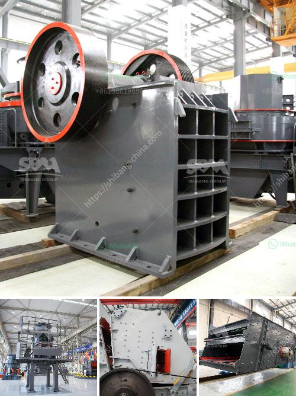

<h3>portable vibrating screen plant</h3>
In various industries, the need for efficient screening operations is prominent. If your business involves processing raw materials such as aggregates, mining, construction, recycling, or even landscaping, a portable vibrating screen plant can enhance your operations by ensuring consistent and reliable screening performance.

A portable vibrating screen plant is a versatile screening tool that can be easily transported and set up at different job sites. It is specifically designed for the efficient screening of any type of material, including sand, gravel, asphalt, and concrete, among others. The plant can be used in multiple applications and is capable of handling various capacities.

One of the key advantages of a portable vibrating screen plant is its high mobility. The entire system is mounted on a trailer, which allows it to be transported to different locations with ease. This feature is particularly beneficial for companies that work on multiple job sites or need to move their screening operations frequently. Additionally, the compact design of the plant ensures minimum footprint, saving valuable space at the job site.

The portable vibrating screen plant incorporates a vibrating screen with a triple deck configuration, which enables efficient screening and separation of the desired end product. Depending on the application and material type, the top deck may be fitted with grizzly bars to remove larger stones or debris before they reach the vibrating screens. This not only improves screening efficiency but also protects the screens from damage caused by oversized materials.

The vibrating screens are designed with high-quality materials, ensuring durability and longevity. The screens are available in various sizes and can be easily changed to meet specific screening requirements. The robust construction of the screen panels guarantees optimal screening performance, even under heavy loads.

To maximize efficiency, the portable vibrating screen plant is equipped with adjustable screening angles. This enables operators to fine-tune the angle of the screens to achieve the desired end product size and optimize throughput. Additionally, adjustable speed controls allow for precise control over the screening process, ensuring consistent grading of materials.

Another essential feature of the portable vibrating screen plant is the user-friendly control system. The operator can easily control and monitor the entire screening process through a centralized control panel. This allows for quick adjustments, troubleshooting, and real-time monitoring of key parameters such as vibration speed, feed rate, and screening angle.

In conclusion, a portable vibrating screen plant is an indispensable tool for efficient screening operations in various industries. Its high mobility, compact design, and versatile configuration make it an ideal choice for companies that require screening capabilities at different job sites. With its reliable performance, durability, and user-friendly controls, the plant ensures consistent and accurate screening of materials, resulting in improved productivity and profitability. Invest in a portable vibrating screen plant today and take your screening operations to the next level.
<h3>Contact us</h3><ul><li><strong>Whatsapp:&nbsp;<a href="https://wa.me/8613661969651">+8613661969651</a></strong></li><li><a href="https://swt.shibang-china.com/?git&amp;zhl&amp;portable vibrating screen plant"><strong>Online Service(chat now)</strong></a></li></ul><h3>Related</h3><ul><li><a href='raymond mill for limestone india supplier.md'>raymond mill for limestone india supplier</a></li><li><a href='cornerstone equipment inc used rock crushers.md'>cornerstone equipment inc used rock crushers</a></li><li><a href='manufacturing and processing plant.md'>manufacturing and processing plant</a></li><li><a href='cement plant cost estimation cement plant cost.md'>cement plant cost estimation cement plant cost</a></li><li><a href='vibrating screen efficiency.md'>vibrating screen efficiency</a></li></ul>