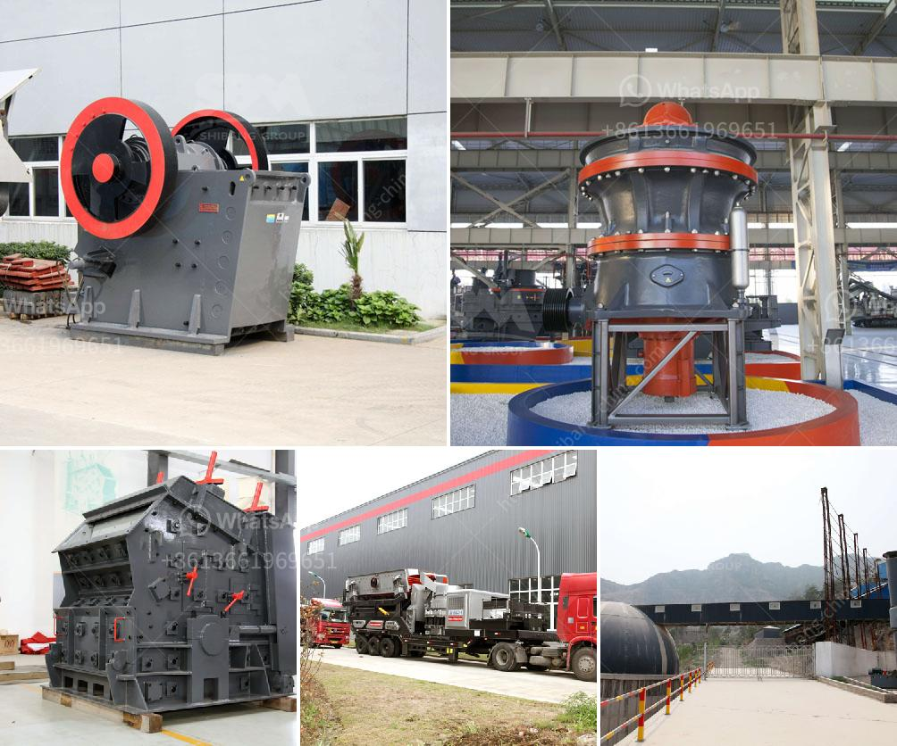

<h3>powder grinding mill</h3>
In this fast-paced world, industries are constantly in search of faster, more efficient, and cost-effective ways to process materials. One of the most critical processes in material processing is grinding, which involves reducing the size of particles to create powders. To accomplish this task efficiently, industries rely on powder grinding mills, powerful machines capable of transforming coarse materials into fine powders. In this article, we will explore the features, benefits, and significance of powder grinding mills in various industries.

Powder grinding mills are industrial equipment designed to break down materials into smaller particles. They are commonly used in various industries, including mining, construction, chemical, metallurgical, and pharmaceutical industries. These mills have a wide range of applications, from grinding raw materials to producing fine powders for use in different processes.

The key features of powder grinding mills include their ability to handle a wide range of materials, adjustable particle size distribution, robust construction, and ease of operation. They employ high-speed rotating blades or hammers to break down materials, and the resulting fine powders are collected in a container or through a pneumatic system. Advanced mills also utilize grinding media, such as balls or rods, to achieve even finer particle sizes.

One of the significant benefits of powder grinding mills is their ability to produce precisely sized powders. These mills allow operators to adjust the particle size distribution according to specific requirements, ensuring consistent and accurate results. This precise control over particle size is important in industries like pharmaceuticals, where dosage accuracy is crucial and can impact patient safety.

Furthermore, powder grinding mills offer exceptional flexibility in terms of material handling. They can process both dry and wet materials, including fragile, heat-sensitive, or cohesive substances. This versatility makes them suitable for a wide range of materials, from minerals and ores to chemicals and food products. Additionally, these mills can handle materials with varying hardness levels, from soft to extremely hard materials like diamonds or silicon carbide.

The robust construction of powder grinding mills ensures their longevity and minimal maintenance requirements, making them highly cost-effective. The wear-resistant materials used in the design of these mills allow for prolonged operation without the need for frequent replacements or repairs. Moreover, many mills come with advanced safety features, such as automatic shut-off mechanisms and overload protection, ensuring the operator's safety during operation.

The significance of powder grinding mills in various industries cannot be overstated. In the mining industry, these mills are pivotal in extracting valuable minerals from ore. In the chemical industry, they are utilized for grinding catalysts and producing fine chemical powders. Pharmaceutical companies rely on these mills to produce active ingredients and improve drug formulations. Additionally, in the construction industry, powder grinding mills are used to process materials like cement, gypsum, or limestone, which are essential in manufacturing concrete and other building materials.

In conclusion, powder grinding mills are indispensable tools for industries that require efficient particle size reduction and fine powder production. Their ability to handle a wide range of materials, adjust the particle size distribution, and their robust construction make them the ultimate solution for various material processing needs. With their versatility and precision, powder grinding mills continue to play a crucial role in driving the progress and innovation in many industries around the world.
<h3>Contact us</h3><ul><li><strong>Whatsapp:&nbsp;<a href="https://wa.me/8613661969651">+8613661969651</a></strong></li><li><a href="https://swt.shibang-china.com/?git&amp;zhl&amp;powder grinding mill"><strong>Online Service(chat now)</strong></a></li></ul><h3>Related</h3><ul><li><a href='stone crusher plant cost saudi.md'>stone crusher plant cost saudi</a></li><li><a href='mobile coal cone crusher for hire malaysia.md'>mobile coal cone crusher for hire malaysia</a></li><li><a href='price list jaw crusher 150 x 200mm.md'>price list jaw crusher 150 x 200mm</a></li><li><a href='crushing of iron ore.md'>crushing of iron ore</a></li><li><a href='aggregate crushers for sale.md'>aggregate crushers for sale</a></li></ul>