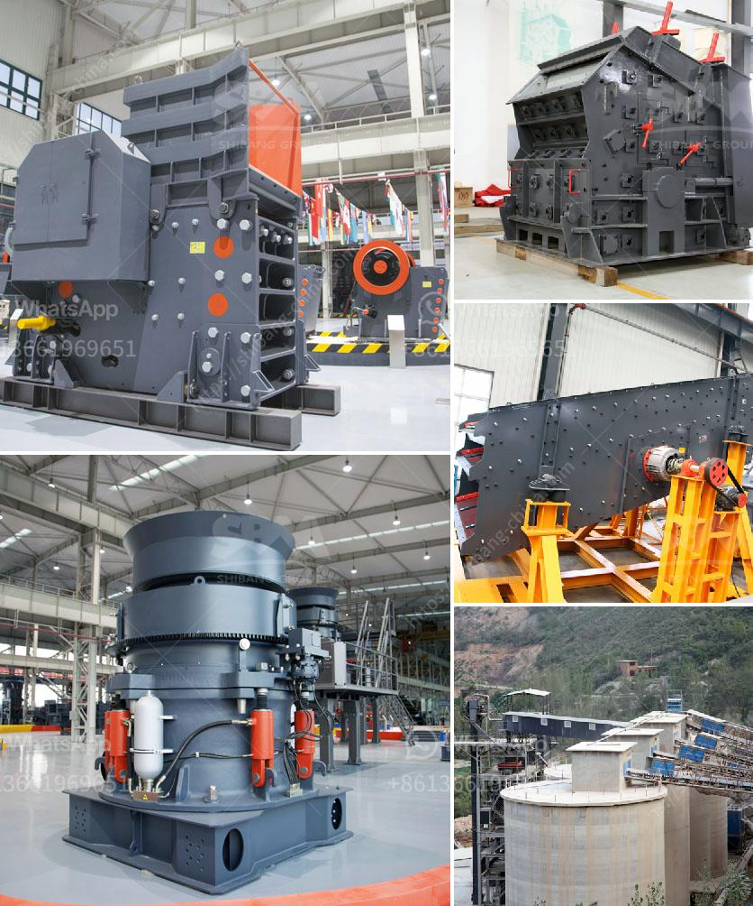

<h3>price conveyor belt</h3>
Conveyors play a crucial role in various industries, facilitating the transportation of materials and goods from one point to another. One of the key components of a conveyor is the conveyor belt. It is responsible for carrying the load and ensuring smooth and efficient movement. However, when considering the purchase of a conveyor belt, price becomes an important factor to consider.

The price of a conveyor belt can vary depending on several factors. One of the primary factors is the material used in the construction of the belt. Conveyor belts are available in a variety of materials such as rubber, PVC, nylon, and steel. Each material has its own set of advantages and disadvantages, leading to varying price ranges.

Rubber conveyor belts are the most commonly used type due to their versatility and cost-effectiveness. They are suitable for a wide range of applications, from mining and agriculture to food processing and packaging. The price of rubber conveyor belts can vary depending on the specific requirements of the industry. For example, if the belt needs to be oil and heat resistant, the cost may be higher compared to a standard rubber belt.

PVC conveyor belts are another popular choice, especially in industries where sanitation is a priority. They are more resistant to chemicals and oils compared to rubber belts. The price of PVC conveyor belts is generally lower than rubber belts, making them a cost-effective option for many businesses.

Nylon conveyor belts offer high tensile strength and durability. They are ideal for heavy-duty applications, such as mining and construction. However, they tend to be more expensive compared to rubber and PVC belts due to their superior performance and longevity.

Steel conveyor belts are the most expensive option due to their robustness and ability to handle heavy loads. They are commonly used in industries such as mining, steel manufacturing, and automotive. The high price of steel belts is justified by their exceptional strength and longevity, making them a worthwhile investment for businesses with demanding material handling requirements.

In addition to the material, the size and design of the conveyor belt also influence its price. Customization requirements, such as specialized designs or unique dimensions, can increase the price significantly. Conveyor belts with additional features, such as tracking systems or sidewalls, may also result in a higher price tag. Therefore, it is essential to carefully analyze the specific needs of your industry and choose a conveyor belt that offers the necessary functionalities at a reasonable price.

When purchasing a conveyor belt, considering the long-term cost is crucial. While a cheaper belt may seem like a cost-saving option initially, it may require frequent repairs and replacements, resulting in higher overall expenses. On the other hand, investing in a more expensive belt with better durability and performance can maximize efficiency and minimize maintenance costs in the long run.

In conclusion, when it comes to conveyor belts, price is a significant consideration. However, it should not be the sole deciding factor. The material, size, design, and long-term cost should all be taken into account to ensure that the chosen conveyor belt meets the specific needs of the industry while providing value for money. By carefully evaluating these factors, businesses can strike the right balance between price and functionality when selecting a conveyor belt.
<h3>Contact us</h3><ul><li><strong>Whatsapp:&nbsp;<a href="https://wa.me/8613661969651">+8613661969651</a></strong></li><li><a href="https://swt.shibang-china.com/?git&amp;zhl&amp;price conveyor belt"><strong>Online Service(chat now)</strong></a></li></ul><h3>Related</h3><ul><li><a href='stone sand making process pdf.md'>stone sand making process pdf</a></li><li><a href='hammer crusher german made.md'>hammer crusher german made</a></li><li><a href='stone crusher of mandibila in argentina.md'>stone crusher of mandibila in argentina</a></li><li><a href='famous stone cone crusher for mining industry.md'>famous stone cone crusher for mining industry</a></li><li><a href='how much is scm series ultrafine mill machine in usa.md'>how much is scm series ultrafine mill machine in usa</a></li></ul>