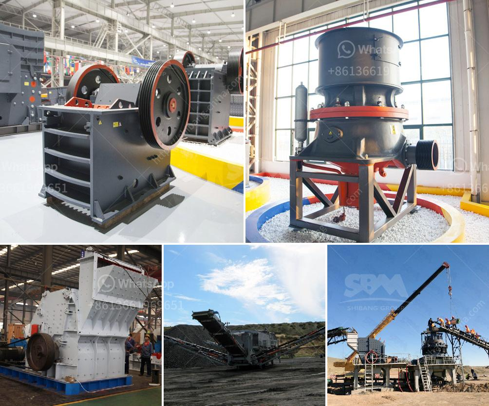

<h3>price for jaw crusher</h3>
The jaw crusher is a versatile crushing device that is capable of breaking down a variety of materials such as granite, limestone, and even concrete. It has a narrow, yet powerful and efficient jaw opening that allows it to handle hard materials efficiently. Although jaw crushers are available in a variety of sizes and models, the price of a jaw crusher varies greatly depending on the specifications of the machine.

Typically, the price of a jaw crusher ranges between tens of thousands and hundreds of thousands of dollars. The specific price of the jaw crusher is determined by factors such as the model, specifications, and quality of the machine. As the leading manufacturer and exporter in China, we will provide maximum preferential factory price and discount for you.

Our jaw crusher has been exported to South Africa, Kenya, Nigeria, Ethiopia, Zambia, Namibia, Somalia, Nepal, Pakistan, Philippines, Malaysia, Saudi Arabic and over 90 countries around the world. So if you want to buy our jaw crusher, you can contact us anytime. We will provide the best price and quality for you.

In addition, to ensure the normal operation of the jaw crusher, in addition to the correct operation, it is also necessary to carry out regular maintenance and repairs. The maintenance and repair costs are also important considerations for the overall price of the jaw crusher. However, considering the long-term benefits of purchasing a jaw crusher, the investment in equipment and maintenance costs are worth it.

In conclusion, the price of a jaw crusher is affected by multiple factors, including the model, specifications, and quality of the machine. It is important to research and compare different models and suppliers before making a purchase to ensure you get the best value for your money. Additionally, proper maintenance and repairs are crucial to extending the lifespan and maximizing the efficiency of your jaw crusher.
<h3>Contact us</h3><ul><li><strong>Whatsapp:&nbsp;<a href="https://wa.me/8613661969651">+8613661969651</a></strong></li><li><a href="https://swt.shibang-china.com/?git&amp;zhl&amp;price for jaw crusher"><strong>Online Service(chat now)</strong></a></li></ul><h3>Related</h3><ul><li><a href='process of roll milling.md'>process of roll milling</a></li><li><a href='stone crusher of mandibila in argentina.md'>stone crusher of mandibila in argentina</a></li><li><a href='how to calculate grinding media in cement mill.md'>how to calculate grinding media in cement mill</a></li><li><a href='kaolin processing equipment.md'>kaolin processing equipment</a></li><li><a href='stone crusher machine malaysia.md'>stone crusher machine malaysia</a></li></ul>