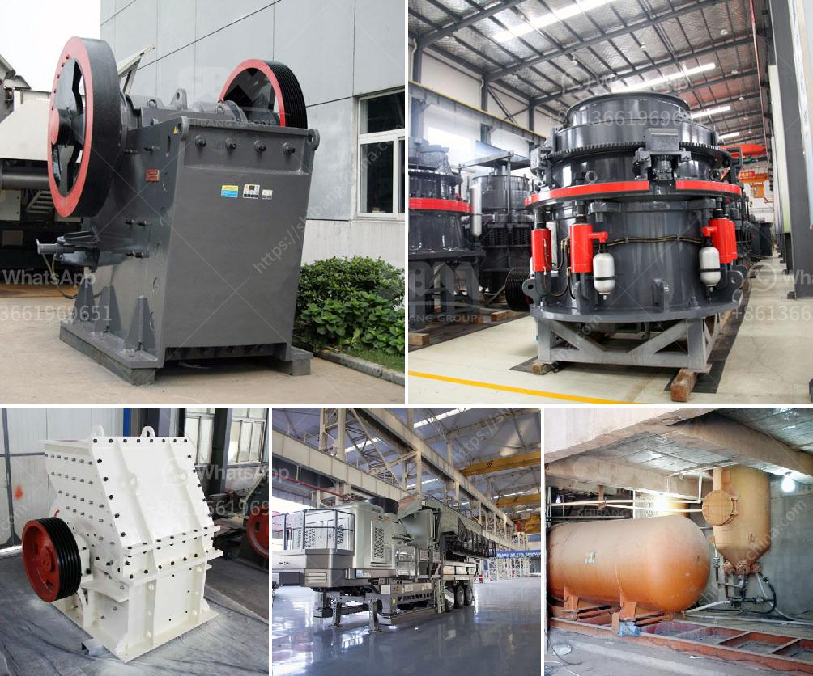

<h3>price hammer mill price mill pulverizer</h3>
In today's industrial sector, the demand for efficient and cost-effective machinery is growing rapidly. One such machine that has gained popularity in recent years is the price hammer mill. Known for its versatility and affordability, the price hammer mill is a type of mill pulverizer that is used to shred a wide range of materials into smaller particles.

The price hammer mill operates on the principle of sheer impact. It consists of a rotor with hammers that spin at high speeds within a cylindrical housing. As the rotor rotates, the hammers strike and break down the material, reducing its size. The shredded material is then discharged from the bottom of the mill.

One of the key advantages of the price hammer mill is its versatility. It can be used to grind and pulverize various materials, such as grains, legumes, herbs, spices, and even wood. This makes it a valuable tool for a wide range of industries, including agriculture, food processing, chemical, and pharmaceutical.

Another significant advantage of the price hammer mill is its cost-effectiveness. Compared to other types of mill pulverizers, the price hammer mill tends to have a lower initial investment and operating cost. This makes it particularly attractive for small and medium-sized businesses that are looking for an affordable solution to their grinding and pulverizing needs.

The price hammer mill comes in various sizes and capacities, depending on the specific requirements of the application. For example, a smaller model with a capacity of 300-500 pounds per hour may be suitable for a small farm or laboratory, while a larger model with a capacity of several tons per hour would be more appropriate for an industrial setting.

When considering the purchase of a price hammer mill, there are several factors to take into account. Firstly, the material that needs to be processed and its desired particle size should be considered. This will determine the specific type and size of the mill required. Secondly, the required capacity and outlet size should be taken into account to ensure that the mill can meet the production requirements.

Maintenance and operational costs should also be considered. The price hammer mill typically requires regular maintenance, including lubrication and cleaning. Additionally, the cost of replacement parts should be taken into account to ensure that the mill remains operational and cost-effective in the long run.

In conclusion, the price hammer mill is a versatile and affordable mill pulverizer that offers numerous advantages for a wide range of industries. Its ability to grind and pulverize various materials, coupled with its cost-effectiveness, makes it an attractive option for businesses of all sizes. When considering the purchase of a price hammer mill, it is essential to take into account the specific requirements, capacity, and maintenance costs to ensure optimal performance and longevity.
<h3>Contact us</h3><ul><li><strong>Whatsapp:&nbsp;<a href="https://wa.me/8613661969651">+8613661969651</a></strong></li><li><a href="https://swt.shibang-china.com/?git&amp;zhl&amp;price hammer mill price mill pulverizer"><strong>Online Service(chat now)</strong></a></li></ul><h3>Related</h3><ul><li><a href='crushing plant flow sheet.md'>crushing plant flow sheet</a></li><li><a href='malaysia heavy industries crushing equipment china.md'>malaysia heavy industries crushing equipment china</a></li><li><a href='aggregate production process.md'>aggregate production process</a></li><li><a href='stone quarry crusher machines.md'>stone quarry crusher machines</a></li><li><a href='hammer mill santa cross.md'>hammer mill santa cross</a></li></ul>