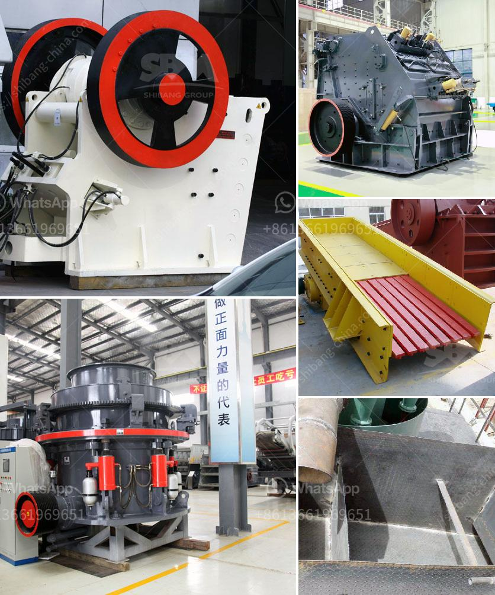

<h3>price list of cone crushers made in china</h3>
China is known for its vast industrial capabilities and is recognized as a global manufacturing hub. When it comes to cone crushers, China has emerged as one of the leading countries manufacturing these crushing machines. With a multitude of manufacturers available, it is important to have a comprehensive understanding of the price range and features offered by different manufacturers.

The price list of cone crushers made in China features a wide range of machines from well-known manufacturers. Some of the major players in this industry include Jiaozuo Zhongxin Heavy Industry, Shanghai Shibang Machinery, Shandong Jinbaoshan Machinery, and Henan Dewo Machinery. These manufacturers offer a range of options, from basic models to high-performing machines equipped with advanced features.

The prices of cone crushers made in China start from as low as $18,000 for the simplest model, with the most expensive one reaching up to $239,000. The cone crushers manufactured in China are characterized by their advanced features, including the ability to automatically adjust the discharge opening size, ensuring high efficiency, ease of use, and reliable performance.

The price range of these cone crushers caters to various budgets and requirements, making them accessible to a wide range of customers. Whether it is for mining, construction, or recycling applications, the cone crushers made in China provide a cost-effective solution for crushing needs.

In addition to the competitive pricing, the cone crushers made in China also offer excellent after-sales services. Many manufacturers provide strong technical support, efficient spare parts supply, and comprehensive training programs to ensure smooth operations and maximize the lifespan of these machines.

It is important to note that while the price list provides a general indication of the cost of cone crushers made in China, it is recommended to contact manufacturers directly for precise pricing information and to discuss specific requirements. This will ensure that customers receive the best possible solution tailored to their needs.

In summary, cone crushers made in China are competitively priced and offer a range of options to cater to different requirements. With advanced features, reliable performance, and comprehensive after-sales support, these machines provide a cost-effective and efficient solution for various crushing applications. As China continues to be a global manufacturing leader, the price list of cone crushers made in China is worth considering for those in the market for such equipment.
<h3>Contact us</h3><ul><li><strong>Whatsapp:&nbsp;<a href="https://wa.me/8613661969651">+8613661969651</a></strong></li><li><a href="https://swt.shibang-china.com/?git&amp;zhl&amp;price list of cone crushers made in china"><strong>Online Service(chat now)</strong></a></li></ul><h3>Related</h3><ul><li><a href='how does a jaw crusher limestone.md'>how does a jaw crusher limestone</a></li><li><a href='malaysia industrial mill.md'>malaysia industrial mill</a></li><li><a href='jaw crusher manufacturers.md'>jaw crusher manufacturers</a></li><li><a href='puzolana 250 tph crusher.md'>puzolana 250 tph crusher</a></li><li><a href='cara menghitung biaya pemasangan stone crusher plant.md'>cara menghitung biaya pemasangan stone crusher plant</a></li></ul>