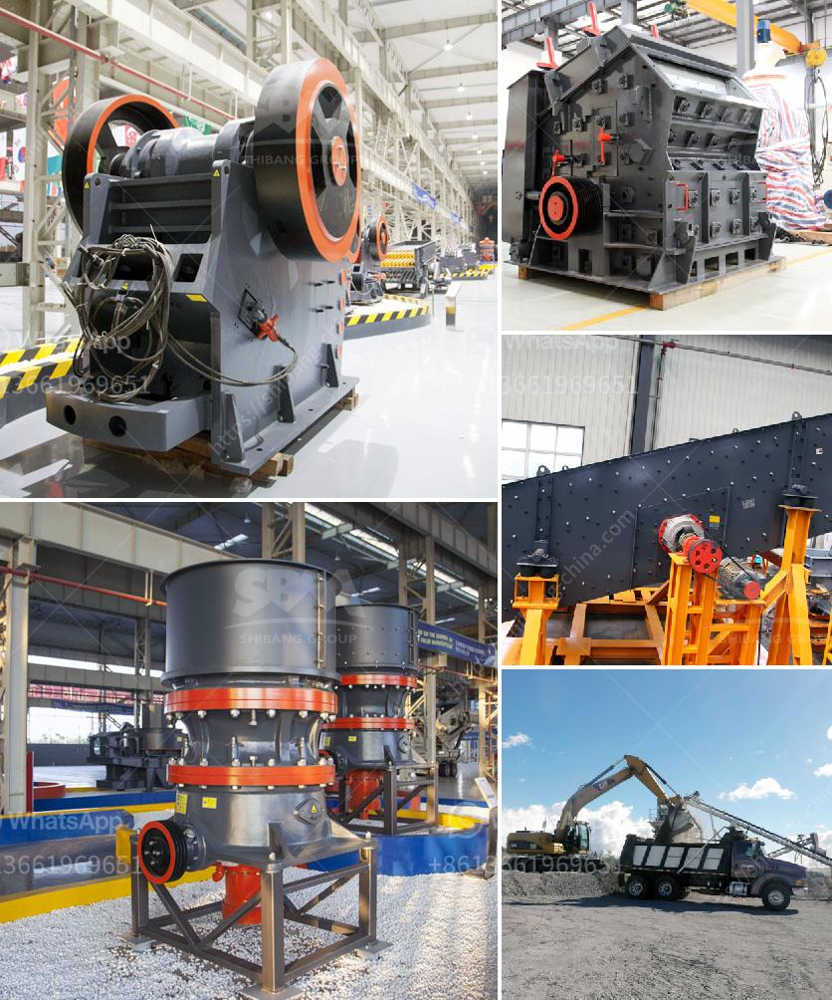

<h3>price list stone crusher german</h3>
When it comes to choosing the right stone crusher for your construction project, one must take into consideration the different options available. The price list stone crusher German is made up of different types and sizes of crushed stone. Most of the stone crushers for sale in Germany are used for crushing natural rocks and stones (such as granite, limestone, basalt, andesite, etc.), but also include construction waste materials such as concrete, bricks, and asphalt.

The prices of stone crusher German vary, depending on the type and model of the equipment. As a leading manufacturer of stone crushers in Germany, SBM provides a comprehensive range of stone crushers for sale in Germany. Whether you're looking for a small stone crusher for a DIY project or a larger stone crusher for commercial use, we have the perfect solution for you.

Prices for stone crusher German can range from €3,500 to €85,000. In addition to the quality and performance of the equipment, the price of stone crusher German also affects the profits of customers when investing in stone crusher German. If the manufacturer's equipment is investment-worthy and reliable, indicators such as price, costs, profits, production capacity, and the recovery cycle of the investment can be estimated more accurately.

To find an affordable stone crusher German, it is necessary to ensure that the equipment is within your budget range. It is also important to compare prices from different suppliers to get the best deal. Consider factors such as warranty, after-sales service, and availability of spare parts when making your purchase decision.

Stone crushers can be a valuable asset to any construction site or project, providing cost-effective and reliable solutions for crushing materials. With the right stone crusher German on your side, you can easily crush stones and other materials to the desired size, saving time and money on your construction projects.

In conclusion, when considering the price list stone crusher German, it is crucial to take into account factors such as the type and model of the equipment, quality and performance, affordability, and after-sales service. By considering these aspects, customers can choose the most suitable stone crusher German for their specific needs, ensuring a successful and cost-effective construction project.
<h3>Contact us</h3><ul><li><strong>Whatsapp:&nbsp;<a href="https://wa.me/8613661969651">+8613661969651</a></strong></li><li><a href="https://swt.shibang-china.com/?git&amp;zhl&amp;price list stone crusher german"><strong>Online Service(chat now)</strong></a></li></ul><h3>Related</h3><ul><li><a href='grinding pigments for technology.md'>grinding pigments for technology</a></li><li><a href='stone quarry equipment price in ethiopia.md'>stone quarry equipment price in ethiopia</a></li><li><a href='ultrafine pulverizer.md'>ultrafine pulverizer</a></li><li><a href='concrete crushing machine cost.md'>concrete crushing machine cost</a></li><li><a href='ballast crusher plant.md'>ballast crusher plant</a></li></ul>