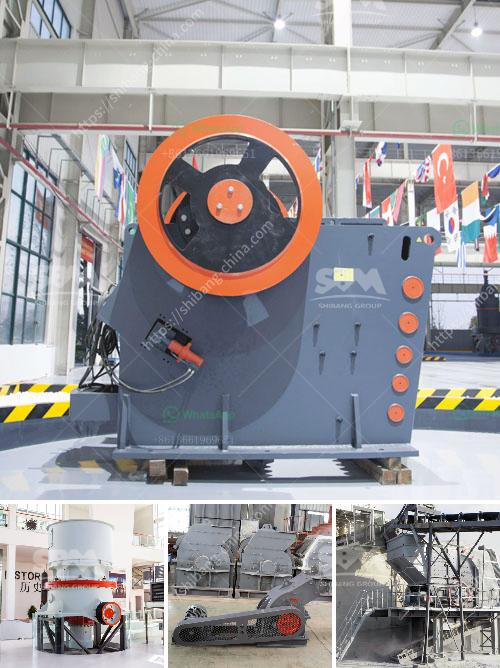

<h3>price of a set of stone crushing machine</h3>
The price of a set of stone crushing machines may vary greatly depending on factors such as the specifications of the machines, the capacity of the crushing plant, and various geographical factors.

The cost of a stone crushing machine consists of various factors that determine the nature of the manufacturing process. These include the labor cost, raw material cost, technology cost, and machinery cost. In addition, the exchange rate also affects the price of the stone crushing machine. For example, exchanging the local currency to another currency at a higher rate may increase the price of the machine.

The labor cost in different regions varies significantly, affecting the overall cost of the machine. Labor-intensive countries may have lower labor costs compared to developed countries with higher labor standards. Moreover, labor wages also differ in various regions within a country. This labor cost directly affects the final price of the stone crushing machine.

The availability and cost of raw materials play a crucial role in determining the price of stone crushing machines. Natural stones, including granite, limestone, and basalt, are widely used in the construction industry. However, the availability of these stones varies in different regions, impacting the cost of production. Accessibility to the raw materials must be considered when determining the final price of the machine.

The technology used in the manufacturing process is another factor influencing the cost of a set of stone crushing machines. Advanced technology with high-quality equipment results in a more efficient and expensive manufacturing process. The use of modern technology does not only enhance the quality of the machines but also increases their durability and productivity. However, this also translates into an increased price.

Machinery cost is another crucial element in determining the price of stone crushing machines. Machinery, such as crushers, conveyors, screens, and feeders, are essential components of a crushing plant. Investing in high-quality machinery and equipment may initially increase the cost of the machine, but it also ensures long-term performance and efficiency. Inferior machinery tends to have a shorter lifespan, requiring frequent repairs and replacements, resulting in additional costs.

Geographical factors can significantly impact the overall price of a set of stone crushing machines. Importing machines from other countries may involve additional costs such as shipping, customs duties, and taxes, leading to an increased final price. Moreover, certain regions may have higher transportation costs, resulting in an elevated price for machines delivered to those areas.

In conclusion, the price of a set of stone crushing machines is influenced by various factors, including labor cost, raw material cost, technology cost, machinery cost, and geographical factors. Each of these factors plays a crucial role in determining the final price of the machine. Investing in high-quality machinery is essential, as it ensures long-term efficiency and productivity, thus maximizing the return on investment. Prospective buyers should carefully consider all these factors before purchasing stone crushing machines for their project.
<h3>Contact us</h3><ul><li><strong>Whatsapp:&nbsp;<a href="https://wa.me/8613661969651">+8613661969651</a></strong></li><li><a href="https://swt.shibang-china.com/?git&amp;zhl&amp;price of a set of stone crushing machine"><strong>Online Service(chat now)</strong></a></li></ul><h3>Related</h3><ul><li><a href='used crushing plant for sale.md'>used crushing plant for sale</a></li><li><a href='copper ore complete concentrating method.md'>copper ore complete concentrating method</a></li><li><a href='sand wash plants for sale in texas.md'>sand wash plants for sale in texas</a></li><li><a href='crushing plant manufacturers in kenya for quartz.md'>crushing plant manufacturers in kenya for quartz</a></li><li><a href='copper ore processing.md'>copper ore processing</a></li></ul>