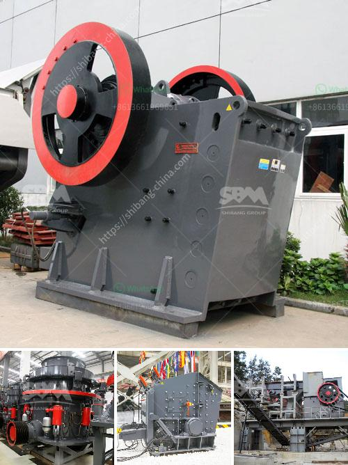

<h3>price of ballast crusher machine in kenya</h3>
The price of a ballast crusher machine in Kenya can be quite expensive depending on the model, size and the brand. The quality of the ballast crusher machine also determines the amount of money you will pay for it. If you invest in a high-quality machine, you can expect to spend more money on it. However, you will enjoy its long lifespan and high efficiency.

Ballast crushers are used to crush stones into small pieces to produce railway ballast in building materials. They can also be used to break down large stones into gravel or base course. They are usually used in construction sites, quarries and railway track beds.

The ballast crusher machine is a specialized machine dedicated to the crushing of ballast. It can be used in primary and secondary crushing for various rocks and stones. It has a low installation and operation cost, flexible movement and excellent performance. It can make various types of ballast material to meet the required specifications.

When choosing a ballast crusher machine, it is important to consider the type and quantity of ballast that is required for the project. Different types of projects require different qualities of ballast. For example, high-speed railway construction requires high-quality ballast that is uniform in size and has good drainage properties.

The price of a ballast crusher machine will depend on its size, brand and quality. For instance, a smaller machine may cost less than a larger one with the same capacity. However, this will also depend on the market conditions and competition among manufacturers.

In Kenya, balast crusher machines are available in kenya for additional crushing or shaping of the stones midway through the process.

Ballast crushers are sold in Kenya as stationary crushers or mobile units. They can be used on anything from a small building site to a larger quarry where they are either reused onsite or sold to third parties.

Ballast crushers have a simple structure and are easy to operate. They can crush all kinds of materials with compressive strength up to 320 MPa. They have the advantages of large crushing ratio, high efficiency, low energy consumption, uniform product size and uniform particle shape.

The price of a ballast crusher machine in Kenya can vary depending on the machine's capacity and efficiency. It is important to choose the right machine to get the desired results.

To ensure that you get a high-quality machine, it is advisable to buy from a reputable manufacturer or supplier. They will provide you with a reliable machine that meets your requirements. You can also compare prices from different suppliers to get the best deal.

In conclusion, the price of a ballast crusher machine in Kenya depends on the model, size and brand. It is important to choose a high-quality machine that meets your requirements. Investing in a high-quality machine may cost more initially but will save you money in the long run. It will have a longer lifespan and offer higher performance.
<h3>Contact us</h3><ul><li><strong>Whatsapp:&nbsp;<a href="https://wa.me/8613661969651">+8613661969651</a></strong></li><li><a href="https://swt.shibang-china.com/?git&amp;zhl&amp;price of ballast crusher machine in kenya"><strong>Online Service(chat now)</strong></a></li></ul><h3>Related</h3><ul><li><a href='mobile crusher for hire in ghana.md'>mobile crusher for hire in ghana</a></li><li><a href='dolomite processing equipment.md'>dolomite processing equipment</a></li><li><a href='rock crusher zenith.md'>rock crusher zenith</a></li><li><a href='canber de broage ciment.md'>canber de broage ciment</a></li><li><a href='700t h mobile crusher.md'>700t h mobile crusher</a></li></ul>