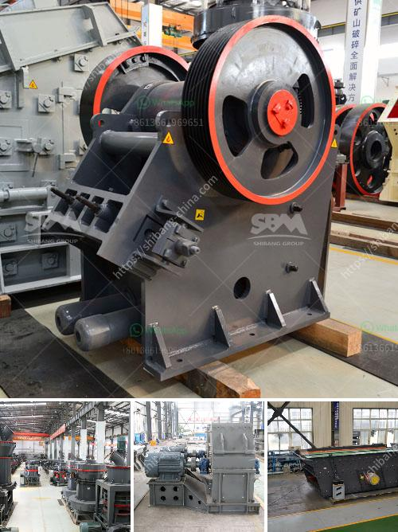

<h3>price of industrial ball mills</h3>
The cost of industrial ball mills can vary widely depending on factors such as the size, weight, and materials used to construct the equipment. However, one common factor that contributes to their high price tag is the machinery and technology needed to meet industry demands.

Industrial ball mills are widely used in various industries such as mining, construction, and pharmaceuticals. They are designed to grind materials into fine particles, resulting in the production of powders and substances for further processing.

The price of industrial ball mills can range from a few thousand dollars up to several hundred thousand dollars, depending on the model and capacity. These mills come in different sizes and can accommodate various production requirements. For instance, smaller mills with a lower capacity may be suitable for laboratories or small-scale operations, whereas larger mills with higher capacities are often utilized in large-scale industrial settings.

The price of industrial ball mills also reflects the level of automation and sophistication of the equipment. More advanced technologies, such as computerized controls and advanced motor systems, can increase the efficiency and productivity of the milling process. However, these additional features come at an additional cost.

In addition to the machinery itself, other factors that contribute to the price include transportation, installation, and maintenance costs. Industrial ball mills are typically large and heavy, requiring specialized transportation and installation services. Furthermore, regular maintenance and repairs are necessary to ensure optimal performance and prolong the lifespan of the equipment.

Despite their high price, industrial ball mills are essential pieces of equipment for many industries. Their ability to grind materials efficiently and uniformly makes them indispensable for numerous manufacturing processes. Moreover, their durability and longevity can yield substantial long-term benefits, outweighing the initial investment.

In conclusion, the price of industrial ball mills can vary significantly depending on various factors such as size, capacity, and technological advancements. While they may require a significant upfront investment, their efficiency and reliability make them indispensable for many industries. As such, the cost can be considered a worthwhile investment for businesses seeking to enhance their production processes and remain competitive in their respective sectors.
<h3>Contact us</h3><ul><li><strong>Whatsapp:&nbsp;<a href="https://wa.me/8613661969651">+8613661969651</a></strong></li><li><a href="https://swt.shibang-china.com/?git&amp;zhl&amp;price of industrial ball mills"><strong>Online Service(chat now)</strong></a></li></ul><h3>Related</h3><ul><li><a href='used rock roll crusher.md'>used rock roll crusher</a></li><li><a href='total cost of stone crushing unit in india.md'>total cost of stone crushing unit in india</a></li><li><a href='germany made gypsum block wall equipment.md'>germany made gypsum block wall equipment</a></li><li><a href='quartz crushing project report.md'>quartz crushing project report</a></li><li><a href='how much is scm series ultrafine mill machine in usa.md'>how much is scm series ultrafine mill machine in usa</a></li></ul>