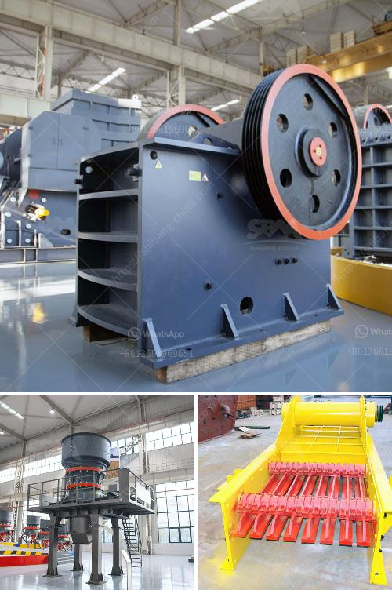

<h3>price of raymond mill</h3>
Raymond mill, also known as the suspension roller Grinding mill, is a traditional milling machine that is mainly used to process various non-flammable and explosive ore materials. Raymond mill has many advantages, such as stable performance, wide application range, simple structure, convenient operation, high efficiency, energy saving, and environmental protection. It is widely used in metallurgy, building materials, chemical industry, mining and other fields.

When it comes to the price of Raymond mill, it is of great concern to customers. As a professional manufacturer of Raymond mill, we will analyze why the price of Raymond mill fluctuates and provide some suggestions for you to purchase a suitable Raymond mill.

Firstly, different manufacturers produce Raymond mills with different specifications, performance, and quality, which leads to different prices. A well-known brand with good reputation is likely to cost more than those unknown brands.

Secondly, the production cost will influence the price of Raymond mill. Manufacturers with advanced technology can produce Raymond mills with higher performance and lower energy consumption, but the production cost will also increase accordingly.

Thirdly, the market supply and demand relationship also impacts the price of Raymond mill. If the market demand is high and the supply is limited, the price of Raymond mill will be relatively high. On the contrary, if the market demand is low or there are many manufacturers in the market, the price of Raymond mill will be relatively low.

Finally, the price of raw materials will also affect the price of Raymond mill. If the price of raw materials such as steel, motor, and bearings increases, the overall cost of Raymond mill production will increase, and the price of Raymond mill will also increase accordingly.

In conclusion, the price of Raymond mill is influenced by various factors, including the manufacturer, production cost, market supply, demand relationship, and the price of raw materials. Therefore, when purchasing Raymond mill, customers should not only pay attention to the price, but also consider the performance, quality, and after-sales service. It is recommended to choose a reliable manufacturer with good reputation, reasonable price, and comprehensive after-sales service, so as to ensure the long-term stable operation of the Raymond mill.
<h3>Contact us</h3><ul><li><strong>Whatsapp:&nbsp;<a href="https://wa.me/8613661969651">+8613661969651</a></strong></li><li><a href="https://swt.shibang-china.com/?git&amp;zhl&amp;price of raymond mill"><strong>Online Service(chat now)</strong></a></li></ul><h3>Related</h3><ul><li><a href='conical ball mill for sale.md'>conical ball mill for sale</a></li><li><a href='prices for stone crushing machine south africa.md'>prices for stone crushing machine south africa</a></li><li><a href='mobile stone jaw crusher equipment.md'>mobile stone jaw crusher equipment</a></li><li><a href='hammer mills for stone.md'>hammer mills for stone</a></li><li><a href='alluvial gold washing machine manufacturer.md'>alluvial gold washing machine manufacturer</a></li></ul>