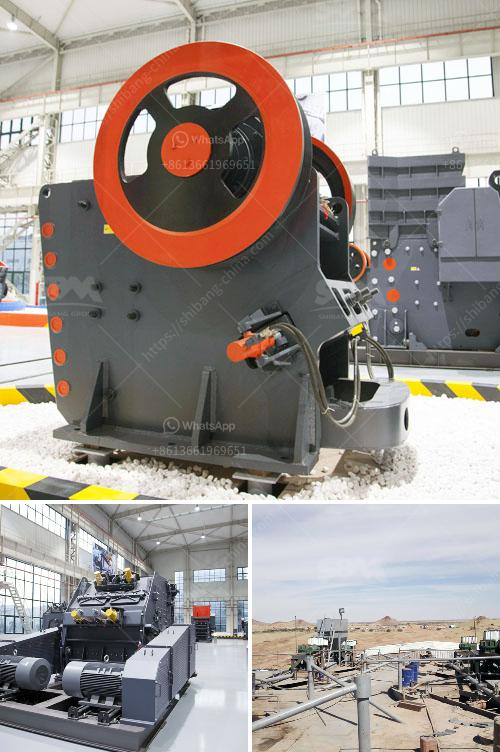

<h3>price of roller mill machine</h3>
The price of a roller mill machine can vary depending on several factors, such as the brand, capacity, and features. Roller mills are used in various industries to grind materials into smaller particles or powders. They are commonly used in the agricultural, chemical, and construction industries.

The cost of a roller mill machine can range from a few thousand dollars to several hundred thousand dollars. The price can increase with higher capacity models, as they are capable of processing larger volumes of materials in a shorter period of time. Additionally, more advanced features and technologies can also contribute to a higher price tag.

When considering the price of a roller mill machine, it is essential to evaluate the overall cost-effectiveness and return on investment. A higher-priced machine may offer greater efficiency, durability, and productivity, resulting in long-term benefits for the user. It is crucial to assess the specific requirements and production demands of your business to determine the most suitable roller mill machine within your budget.

Several factors can significantly impact the price of a roller mill machine. For instance, the brand reputation can play a role. Well-established and reputable brands often offer reliable and high-quality machines, which can come at a higher price. Additionally, the size and design of the machine can also impact its cost. Larger and more complex machines generally require more material and manufacturing efforts, resulting in a higher price.

To ensure you get the best value for your investment, it is recommended to research and compare various brands and models. Consider factors such as warranty, after-sales service, and customer reviews to make an informed decision. Consulting with experts or industry professionals can also provide valuable insights into the price-performance ratio of roller mill machines.

In conclusion, the price of a roller mill machine can vary greatly depending on its brand, capacity, and features. Careful consideration of your business needs and budget is essential in selecting the most suitable machine while ensuring long-term cost-effectiveness and return on investment.
<h3>Contact us</h3><ul><li><strong>Whatsapp:&nbsp;<a href="https://wa.me/8613661969651">+8613661969651</a></strong></li><li><a href="https://swt.shibang-china.com/?git&amp;zhl&amp;price of roller mill machine"><strong>Online Service(chat now)</strong></a></li></ul><h3>Related</h3><ul><li><a href='crusher machine price.md'>crusher machine price</a></li><li><a href='gold mining equipment manufacturers in china.md'>gold mining equipment manufacturers in china</a></li><li><a href='portable cone crusher specification.md'>portable cone crusher specification</a></li><li><a href='famous stone crushing equipment supplier in china.md'>famous stone crushing equipment supplier in china</a></li><li><a href='stone crusher machine price in usa.md'>stone crusher machine price in usa</a></li></ul>