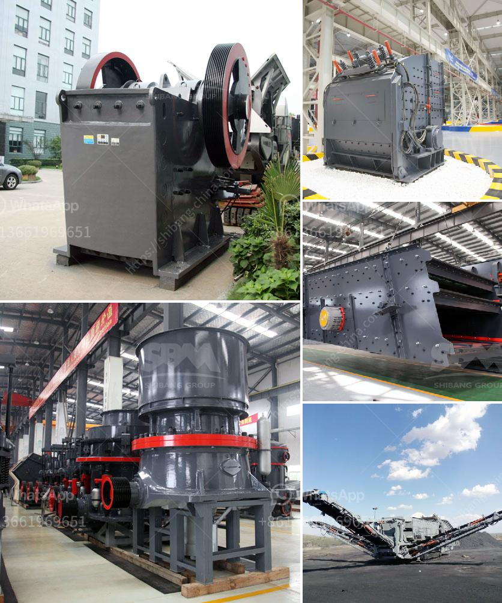

<h3>price of stone crusher stone crusher</h3>
First, steel prices. Steel is the main raw material for making stone crushers, so the price fluctuation of steel prices has a very large impact on the price of equipment. The rise in steel prices will increase the production cost of the crusher manufacturers, so the price of the crusher will increase; second, the price fluctuations of energy sources such as electricity, oil and gas, as well as the rise in labor costs, will also lead to an increase in the price of stone crushers.

When the price of raw materials is high, the overall price of the equipment will also rise, which lastly results to the high quotation in the market. On the contrary, if the prices of raw materials decrease, the production price will also decrease, resulting in the decline of stone crusher price.

Note: If the raw materials is high quality and low price, the stone crusher equipment price will be low, because the competition in this industry is fierce. When the competition is fierce, the price of the equipment will be lower.

Many customers focus on the price of aggregate crushing plant equipment, when purchasing aggregate crushing plant, which is reasonable. In fact, for the quality, the same configuration is not the same for the equipment parts production process, the performance of the equipment is different, and the price will be different, of course; the quality is different.

When investing in a stone crushing plant, not only time and labor are needed, but also the cost of equipment, maintenance expenses, transportation costs, etc. Raw materials occupy a large proportion of the overall cost of stone crushers, so the factor affecting the price should be considered first.

The price of stone crushers basically is affected by raw steel price, labor costs, transportation costs, etc. Raw steel cost is rising day by day. There was a big increase at the beginning of 2018, then the price continues to inscrease. In 2019, it is forcasted that the steel price will have high increase same as 2018. In the following, the stone crushing machines price will increase too.

Before exact rising price pressure, it is best time to order stone crushing machines now. With the progress and development of China's society, infrastructure construction is everywhere, the demand for sand aggregate is also growing rapidly, the development of crushed stone plants has been good. The demand for sand and stone is on the rise, and the price of the stone crusher equipment is more or less stable. Customers are recommended to select manufacturers with greater corporate reputation, aftermarket security, etc. For example, the Henan Hongxing Machinery company has perfect service system, also has many stone crusher clients in India.

If you want to know the stone crusher price or have any questions about stone crusher, please do not hesitate to contact us. Phone: 0086-371-67668558, Whatsapp/Wechat: +0086-13676922906, Email: sales@zxcrusher.com
<h3>Contact us</h3><ul><li><strong>Whatsapp:&nbsp;<a href="https://wa.me/8613661969651">+8613661969651</a></strong></li><li><a href="https://swt.shibang-china.com/?git&amp;zhl&amp;price of stone crusher stone crusher"><strong>Online Service(chat now)</strong></a></li></ul><h3>Related</h3><ul><li><a href='jaw crusher for sale in auction.md'>jaw crusher for sale in auction</a></li><li><a href='stone crushers manufacturer.md'>stone crushers manufacturer</a></li><li><a href='turkish association marble machinery.md'>turkish association marble machinery</a></li><li><a href='roller mill spaider.md'>roller mill spaider</a></li><li><a href='how to calculate grinding media in cement mill.md'>how to calculate grinding media in cement mill</a></li></ul>