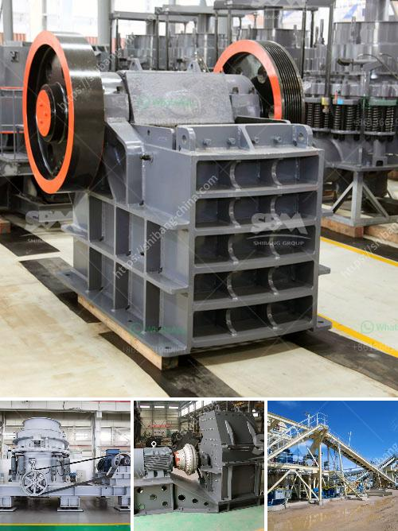

<h3>price of stone crushers in malaysia</h3>
The price of stone crushers in Malaysia is a hot topic in the mining industry. As the leading stone crusher manufacturer and exporter in China, we will provide maximum preferential factory price and discount for you. Our stone crusher has been exported to South Africa, Kenya, Nigeria, Ethiopia, Zambia, Namibia, Somalia, Nepal, Pakistan, Philippines, Malaysia, Saudi Arabic and over 90 countries around the world.

Based on some statistics, the annual output of stone crusher accounts for about 15% of the total output of Malaysia. Due to the lack of raw materials, it cannot produce high-quality stone crushers at a preferential price. At present, the domestic standard of stone crusher can reach more than 70% of the aggregate produced in China. Simply put, the cost of stone crushers in Malaysia is a complex issue because of the complicated design process and the comprehensive economic background. Factors influencing the price of stone crushers in Malaysia:

The quality of the stone crushers determines their price. If the product has poor quality, the price will be lower based on the market demand and supply. In some cases, it may be because the supplier has used low-quality materials and components, which reduces the performance of the equipment and affects its service life.

The brand also plays an important role in determining the price. Well-known brands invest a lot in research and development, which improves the performance and productivity of stone crushers. Therefore, the price of crushers from well-known brands will be higher compared to lesser-known brands. However, customers can rest assured that reputed brands won't compromise on quality.

The stone crushers with higher technology and advanced level have better effect and service life. Technology is constantly improving, and new high-tech crushers are being introduced, which have determined the price trend in the market.

The market demand and supply situation is a key factor that affects the price of stone crushers in any country. Malaysia is no exception. When the demand for stone crushers is high and the supply is low, the price tends to be high, and vice versa.

Transportation costs are also a significant factor in the price of stone crushers. Malaysia is a vast country with large distances to travel. Moreover, the transport infrastructure may not always be well-developed. Consequently, transportation costs can be high, affecting the final price of the equipment.

In conclusion, the price of stone crushers in Malaysia is subject to various factors, such as technology, brand, quality, market demand and supply, transportation costs, etc. While all these factors are important, the quality of equipment is crucial. It is always recommended to choose a reputed and reliable supplier to ensure you get a high-quality stone crusher at a reasonable price.

With our rich experience in the mining industry, we are confident to provide you with the most suitable and cost-effective stone crushers. Our team will offer professional guidance and technical support to meet your specific requirements. Contact us now to get the latest price and more details about our stone crushers in Malaysia.
<h3>Contact us</h3><ul><li><strong>Whatsapp:&nbsp;<a href="https://wa.me/8613661969651">+8613661969651</a></strong></li><li><a href="https://swt.shibang-china.com/?git&amp;zhl&amp;price of stone crushers in malaysia"><strong>Online Service(chat now)</strong></a></li></ul><h3>Related</h3><ul><li><a href='malaysia industrial mill.md'>malaysia industrial mill</a></li><li><a href='used mobile crusher pakistan.md'>used mobile crusher pakistan</a></li><li><a href='jual stone crusher plant kredit.md'>jual stone crusher plant kredit</a></li><li><a href='nigeria stone crusher to buy.md'>nigeria stone crusher to buy</a></li><li><a href='portable concrete crusher for rent qatar.md'>portable concrete crusher for rent qatar</a></li></ul>