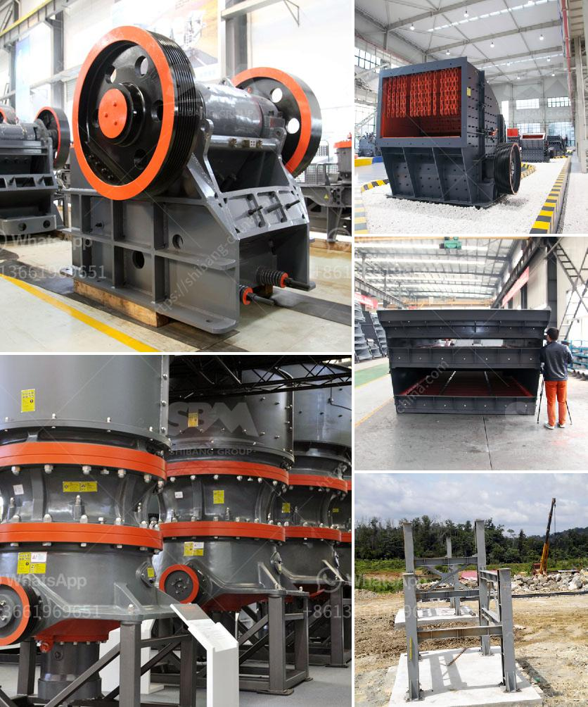

<h3>prices for cheap roller mills in south africa</h3>
If you are someone who enjoys the convenience of freshly-ground flour or grains, then investing in a roller mill is a wise decision. South Africa, with its rich agricultural resources, offers a wide array of roller mills for both personal and commercial use. While some may assume that roller mills are costly, there are affordable options available in the market that provide excellent quality and performance.

When it comes to purchasing a cheap roller mill in South Africa, it is important to consider both the price and the quality of the product. Although affordability may be a significant factor for many, compromising on quality can leave you with a subpar product that may not meet your specific needs.

Fortunately, the South African market offers roller mills that strike the perfect balance between price and quality. These mills are designed to cater to individual needs while keeping the cost within an affordable range. With prices ranging from around R4000 to R10,000, there are several options within the 100-300 word range that can meet both personal and commercial demands.

Many roller mills in South Africa come with various features such as adjustable settings that allow you to customize the coarseness and fineness of the grind. Additionally, some models offer multiple rollers, which enable you to grind different grains simultaneously, saving you time and effort.

When searching for a cheap roller mill in South Africa, it is essential to consider the warranty and after-sales service provided by the manufacturer. While initial affordability is crucial, it is equally important to ensure that the manufacturer is reputable and reliable. Researching customer reviews and checking the warranty terms of different brands is a practical approach to ensure you are making an informed decision.

In conclusion, finding a cheap roller mill in South Africa does not mean compromising on quality. With numerous options available in the market, it is possible to find a roller mill that meets your budget while delivering excellent performance. Remember to consider the features, warranty, and after-sales service provided by the manufacturer to make sure you are investing in a reliable and efficient product. Happy grinding!
<h3>Contact us</h3><ul><li><strong>Whatsapp:&nbsp;<a href="https://wa.me/8613661969651">+8613661969651</a></strong></li><li><a href="https://swt.shibang-china.com/?git&amp;zhl&amp;prices for cheap roller mills in south africa"><strong>Online Service(chat now)</strong></a></li></ul><h3>Related</h3><ul><li><a href='start a stone crusher.md'>start a stone crusher</a></li><li><a href='new generation of hammer mill.md'>new generation of hammer mill</a></li><li><a href='ultra fine grinder advantages.md'>ultra fine grinder advantages</a></li><li><a href='ball mill cost estimate for mining plant.md'>ball mill cost estimate for mining plant</a></li><li><a href='100tph rock plant used for sale.md'>100tph rock plant used for sale</a></li></ul>