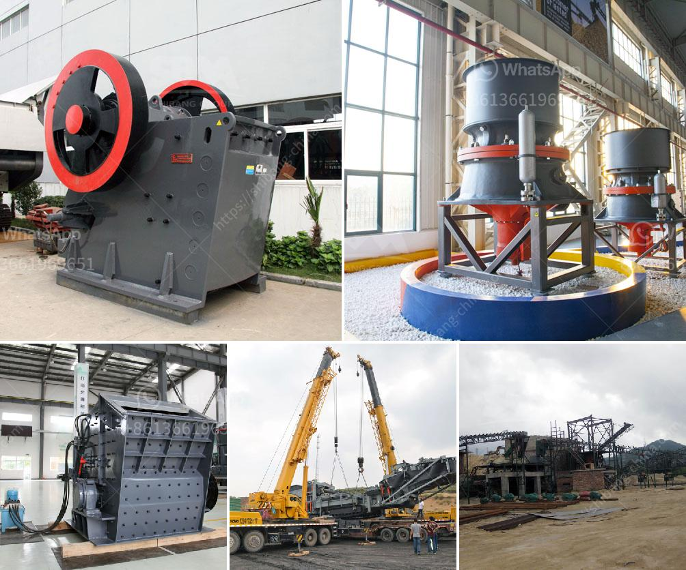

<h3>prices for stone crushing machine south africa</h3>
Stone crushing machine has different types and specifications, different prices, and different profits for customers. Stone crushing machines have been widely used in South Africa for processing materials with various hardness. Zenith has developed crushing equipment for the whole crushing production line.

As the supplier of stone crushing machine, Zenith has various kinds of crusher machines to meet different clients' production requirements of aggregate processing line. To break the raw materials and get the desired size of aggregate size, Zenith provides the primary crusher machine, secondary crusher machine and fine crushing machine. Based on years' experience and technology development, Zenith designed three kinds of crushing plants to meet the different needs of customers.

There are many factors influencing the price of stone crushing machines in South Africa. Firstly, the type of stone crushing machine used by the customers when it comes to the varieties of stone crushing machines, experts remind us that there are many types of crushers. As for the specific types of stone crushing machines, the impact crusher, cone crusher, hammer crusher, roller crusher, and mobile crushing plant are all commonly used ones. The price of these different types of stone crushing machines is different, so their respective prices are also different.

Secondly, the input size impacts the price of stone crushing machine. If the input size is smaller than 300mm, it will be used in the first-phase crushing. Usually, the size of the output size is 0-10mm, 10-20mm, 20-30mm, 30-40mm, 40-50mm, etc. If the input size is too large, it will cause the equipment to be blocked and cannot produce aggregates.

Thirdly, the price of the stone crushing machine depends on the performance of the machine. For example, if the crushing machine has good performance, it can bring additional benefits to the customers. The advanced technology of the machine and its perfect design affect the price of the stone crushing machine.

Customers need to invest the manpower cost when they purchase the stone crushing machine. This is not just a one-time investment, because the machine needs to be repaired and maintained regularly throughout its service life, which increases the labor cost. In order to choose a suitable stone crushing machine, the customers should consider the equipment installation, labor cost, power consumption, and annual maintenance cost, and so on.

In summary, Stone Crushing Business is a profitable and viable venture and it can be initiated with moderate investment. Purchasing crushing machines is expensive and requires plenty of investment. Therefore, stone crushing machine manufacturers are increasingly focusing on research and development of efficient crushing machines to increase production capacity and market share.
<h3>Contact us</h3><ul><li><strong>Whatsapp:&nbsp;<a href="https://wa.me/8613661969651">+8613661969651</a></strong></li><li><a href="https://swt.shibang-china.com/?git&amp;zhl&amp;prices for stone crushing machine south africa"><strong>Online Service(chat now)</strong></a></li></ul><h3>Related</h3><ul><li><a href='mineria de basalto o extraccion de basalto.md'>mineria de basalto o extraccion de basalto</a></li><li><a href='screen astec vibrating screen price.md'>screen astec vibrating screen price</a></li><li><a href='pebble stone crusher.md'>pebble stone crusher</a></li><li><a href='crusher plant saudi.md'>crusher plant saudi</a></li><li><a href='second hand vrm cement mill for sale.md'>second hand vrm cement mill for sale</a></li></ul>