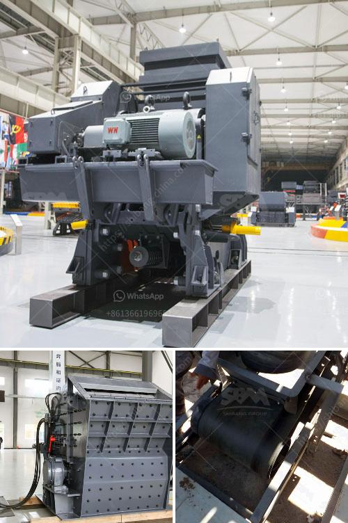

<h3>prices for stone crushing machine zimbabwe</h3>
Prices for stone crushing machines in Zimbabwe are varied and it is important to source from a reliable supplier with a good reputation for quality and service.

There are many stone crushing machines suppliers in Zimbabwe. Different types of machines are manufactured and their prices are also different. The following is a brief analysis of the prices of stone crushing machines in Zimbabwe:

In the work of medium-size crushing, it is mainly composed of the following parts: a blower, a finished cyclone, a roller, a grinding ring, a grinding disc, a hoist, a blade, a back cover, a mill body, an analyzer, and a pipe device. The host is composed of a machine frame, a wind inlet volute, a shovel, a grinding roller, a grinding ring, and a shell cover. The whole set of equipment is driven by the motor to the host through the reducer, and the analysis machine is driven by the transmission devicethe hoist is located at the upper end of the mill. The final size of the grinding material of the grinding machine can be adjusted arbitrarily between 80-600 mesh, and the ultra-fine mill can reach 1200 mesh.

The price of stone crushing machines in Zimbabwe has increased exponentially with the increasing demand for stone crushing products. There has been a considerable rise in the mining industry all over the world to meet the requirements of valuable minerals or geological materials. Stone crushing machines are used for mining as well as processing the minerals extracted.

Stone crushing machines since the natural resources in Zimbabwe are increasingly scarce, many manufacturers are investing in equipment and machinery as mining machinery is the basis of production. In summary, the reform and upgrade of mining machinery have become the foundation for the development of mining industry. It is because of this reform and upgrade that the stone crushing equipment industry is able to continuously grow and develop by leaps and bounds.

The quality and price of the stone crushing equipment in Zimbabwe have been transformed and upgraded in recent years, which have more and more buyers vigorously pursued. It is reported that ASB Industries sold in the market come with excellent performance and are widely used in the mining industry. The ASB Industries stone crushing machines have features of high reliability and high productivity, such as: durable hammer frame, low speed and multi-design hammerhead and easy to maintain. These are just a few of the many features of ASB Industries stone crushing equipment.

In conclusion, the prices of stone crushing machines are different in Zimbabwe. There are many different types of crushing machines at sale in market, such as impact crusher, cone crusher, as well as mobile crusher machines. They all have their own advantages and disadvantages. Customers can choose the right one according to their own production requirements. Choosing a reliable crusher supplier is crucial for buying a suitable machine.
<h3>Contact us</h3><ul><li><strong>Whatsapp:&nbsp;<a href="https://wa.me/8613661969651">+8613661969651</a></strong></li><li><a href="https://swt.shibang-china.com/?git&amp;zhl&amp;prices for stone crushing machine zimbabwe"><strong>Online Service(chat now)</strong></a></li></ul><h3>Related</h3><ul><li><a href='1000 ton crusher.md'>1000 ton crusher</a></li><li><a href='used crusher for sale kenya.md'>used crusher for sale kenya</a></li><li><a href='jual stone crusher philippines.md'>jual stone crusher philippines</a></li><li><a href='rotary kiln manufacturers.md'>rotary kiln manufacturers</a></li><li><a href='gold recovery process flow diagram pdf.md'>gold recovery process flow diagram pdf</a></li></ul>