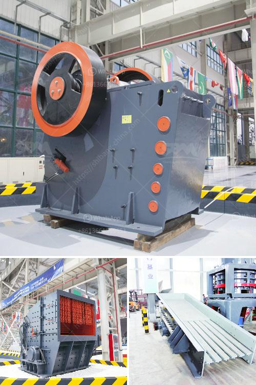

<h3>prices of cement clinker grinding unit in india</h3>
The cement clinker grinding unit in India is one of the cheapest sources of cement clinker available globally. With low capital cost, this is one of the best and most viable options for cement manufacturing entrepreneurs.

While raw materials such as limestone, clay, and gypsum are sourced from various parts of the country, the grinding units are developed by using local clinker. These clinker grinding plants are available at market leading prices and can be customized as per the specifications of the clients.

We procure clinker from reliable sources in India and provide it to our clients at highly competitive prices. These clinker grinding units are made from superior quality raw materials sourced from trustworthy vendors. The units are facilitated with high-performance jaw crushers and ball mills for easy and efficient grinding. We also provide customized designs of these units to suit clients' needs.

Apart from being cost-effective, these clinker grinding units are robust and built to withstand tough operating conditions. The clinker grinding units are made in different sizes and capacities, ranging from 10 to 2000 tons per day and above.

The clinker grinding unit in India is not only environmentally-friendly but also ensures the lowest cost of production. In addition to that, it also offers ease of operation, shorter construction duration, and less investment.

The cement clinker grinding unit in India has attracted multiple investors and cement manufacturers. With a number of government initiatives and development schemes, the country's infrastructure is constantly growing. This has given rise to the demand for cement and various cement-related products.

With the increasing demand for cement and the growing number of cement manufacturing plants in the country, the demand for clinker grinding units is also on the rise. The clinker grinding units are beneficial in terms of cost-efficiency, high-performance, and sustainability.

In conclusion, the price of clinker grinding units is a factor that can attract more investors and cement manufacturers. With the government's Make in India campaign, the cement industry is expected to expand exponentially in the coming years, resulting in the price of clinker grinding units to decrease further.
<h3>Contact us</h3><ul><li><strong>Whatsapp:&nbsp;<a href="https://wa.me/8613661969651">+8613661969651</a></strong></li><li><a href="https://swt.shibang-china.com/?git&amp;zhl&amp;prices of cement clinker grinding unit in india"><strong>Online Service(chat now)</strong></a></li></ul><h3>Related</h3><ul><li><a href='cost of crusher plant.md'>cost of crusher plant</a></li><li><a href='crushing plant manufacturers in china.md'>crushing plant manufacturers in china</a></li><li><a href='pebble stone crusher.md'>pebble stone crusher</a></li><li><a href='limestone processing plant.md'>limestone processing plant</a></li><li><a href='prices for stone crushing machine zimbabwe.md'>prices for stone crushing machine zimbabwe</a></li></ul>