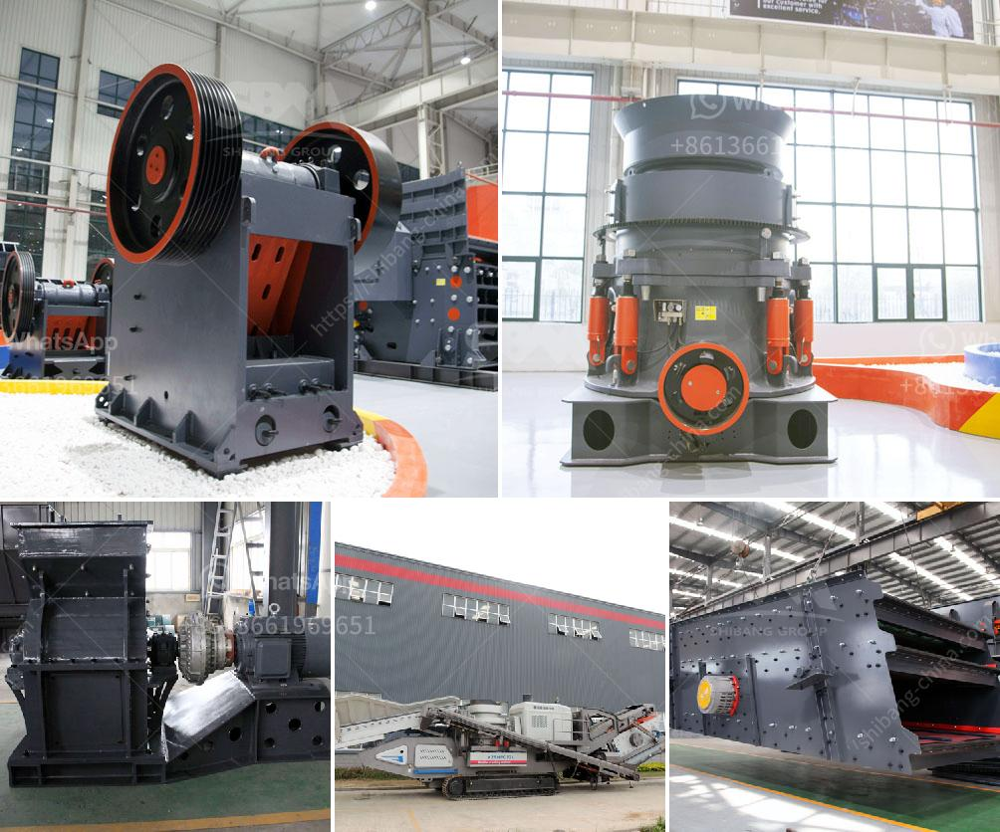

<h3>prices of crusher mandrel</h3>
Crusher mandrels are essential tools used in various industries, such as mining, construction, and quarrying, for crushing and grinding operations. These powerful tools are widely employed to reduce the size of large rocks, stones, or other materials into smaller particles, facilitating further processing or transportation. However, when considering crusher mandrels, it is important to understand the factors that affect their prices and make an informed decision. In this article, we will delve into the cost considerations associated with crusher mandrels.

Firstly, the type and design of the crusher mandrel greatly influence its price. There are several types of crusher mandrels available in the market, such as jaw crushers, cone crushers, impact crushers, and gyratory crushers, each having its unique advantages and applications. The complexity and technology used in these designs can significantly impact their prices. For instance, jaw crushers are generally more affordable compared to cone or gyratory crushers due to their simple design and construction.

Secondly, the size and capacity of the crusher mandrel play a crucial role in determining its price. Crusher mandrels come in various sizes, and their capacity is measured in terms of the maximum feed size they can handle and the throughput they can achieve per hour. Generally, larger and higher-capacity mandrels tend to be more expensive due to the increased materials and engineering requirements. It is important to choose a crusher mandrel that suits your specific needs, balancing capacity requirements with budget constraints.

Moreover, the brand and reputation of the crusher mandrel manufacturer can impact its price. Well-established brands with a strong reputation for quality and reliability often come with a higher price tag. However, investing in a reputable brand can provide assurance in terms of performance, durability, and after-sales service. It is crucial to research and consider customer reviews, industry recommendations, and warranty policies when selecting a crusher mandrel brand that best fits your requirements.

Additionally, the materials used in the construction of the crusher mandrel can affect its price. Mandrels made from high-quality materials, such as hardened steel or alloys, are generally more expensive but offer enhanced durability and longevity. On the other hand, mandrels made from cast iron or other lower-grade materials may be more economical but may suffer from decreased reliability and susceptibility to wear and tear. Assessing the operating conditions, expected lifespan, and maintenance requirements are crucial when factoring in material costs.

Furthermore, geographic location and market demand can influence the pricing of crusher mandrels. Prices may vary between different regions due to factors such as transportation costs, local taxes, import duties, and market competitiveness. It is advisable to consider local supplier options and compare prices across different regions to ensure the best value for your investment.

In conclusion, the prices of crusher mandrels are influenced by multiple factors, including the type and design of the mandrel, its size and capacity, the brand reputation, the materials used, and the market conditions. It is essential to evaluate these factors based on your specific needs, project requirements, and budget constraints. Careful research, comparisons, and consultations with industry experts will assist in making an informed decision and securing a crusher mandrel that offers the best combination of price, quality, and performance.
<h3>Contact us</h3><ul><li><strong>Whatsapp:&nbsp;<a href="https://wa.me/8613661969651">+8613661969651</a></strong></li><li><a href="https://swt.shibang-china.com/?git&amp;zhl&amp;prices of crusher mandrel"><strong>Online Service(chat now)</strong></a></li></ul><h3>Related</h3><ul><li><a href='process chart of sand washing plant.md'>process chart of sand washing plant</a></li><li><a href='high chrome impact crusher spare parts.md'>high chrome impact crusher spare parts</a></li><li><a href='hammer mill in bogota.md'>hammer mill in bogota</a></li><li><a href='coal seal of coal pulverizer.md'>coal seal of coal pulverizer</a></li><li><a href='dolomite rock crusher.md'>dolomite rock crusher</a></li></ul>