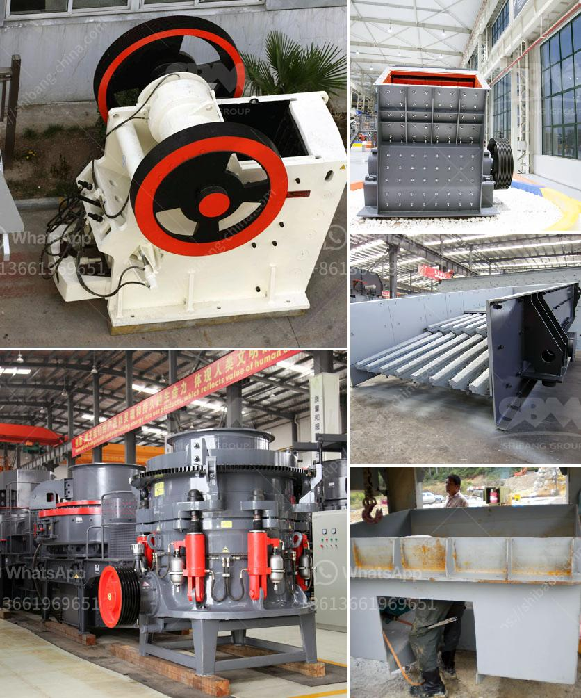

<h3>prices of harmer mills in south africa</h3>
Harmer mills, or hammer mills, are mechanical mills that break down materials into smaller pieces by the repeated blows of a rotating hammer. These mills are commonly used in various industries in South Africa for milling purposes, including agriculture, pharmaceutical, chemical, and mining industries.

The prices of hammer mills in South Africa vary significantly depending on the size, capacity, and installed power of the mill. For small-scale entrepreneurs who are looking for an affordable milling solution, the Agrimag range of hammer mills starts from as low as R9,000, while the Muna range of mills can cost between R20,000 and R60,000.

Agrimag offers a variety of hammer mills suitable for both home and commercial use. Their models are compact and lightweight, making them ideal for small-scale farmers who need to process their own animal feed. These entry-level mills typically have a milling capacity of around 250kg per hour and are powered by small electric motors or, in some cases, even by hand.

Additionally, Agrimag also offers slightly bigger hammer mills with higher capacity and power. These mills can handle larger quantities of materials such as maize, sorghum, or grass, and can produce up to 2,500kg of milled products per hour. These higher capacity models usually come with more powerful electric motors or even diesel engines for improved efficiency.

For larger-scale commercial operations or industrial use, various other options are available. These mills are typically much more powerful, and their prices can range from R80,000 to R230,000 or even higher, depending on the specific requirements of the customer. Some of these mills are capable of handling several tons of material per hour and are commonly used in the production of animal feed, biomass pellets, or even in the mining industry for ore milling.

It's important to note that prices can vary depending on factors such as the brand, manufacturing quality, and additional features of the hammer mill. For instance, some models may come with a built-in pre-crushing system, which can increase the efficiency of the milling process by reducing the size of the raw material before it enters the mill.

In conclusion, the prices of hammer mills in South Africa can range from as low as R9,000 for smaller entry-level models suitable for small-scale farmers, to over R200,000 for larger and more powerful mills used in commercial or industrial operations. Regardless of the specific requirements, prospective buyers can choose from a wide range of options available in the market to find a hammer mill that suits their needs and budget.
<h3>Contact us</h3><ul><li><strong>Whatsapp:&nbsp;<a href="https://wa.me/8613661969651">+8613661969651</a></strong></li><li><a href="https://swt.shibang-china.com/?git&amp;zhl&amp;prices of harmer mills in south africa"><strong>Online Service(chat now)</strong></a></li></ul><h3>Related</h3><ul><li><a href='lime stone crusher with capacity.md'>lime stone crusher with capacity</a></li><li><a href='crushers made in south philippines.md'>crushers made in south philippines</a></li><li><a href='mobile crusher algerie.md'>mobile crusher algerie</a></li><li><a href='crusher unit and quarry land for sale.md'>crusher unit and quarry land for sale</a></li><li><a href='crushing and screening companies in south africa.md'>crushing and screening companies in south africa</a></li></ul>