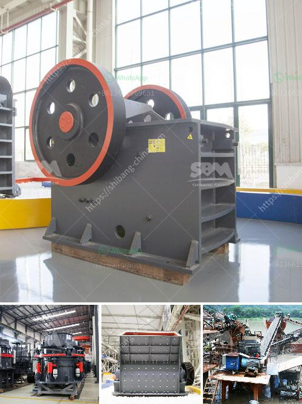

<h3>primary and secondary crusher</h3>
Primary and secondary crushers are both important pieces of equipment in the mining and construction industry. They help break large rocks into smaller, more manageable materials for further processing or transportation. In this article, we will discuss the primary and secondary crusher in detail, highlighting their key features and differences.

The primary crusher is the first step in the initial processing stage. The size reduction is accomplished by the crusher's crushing action. There are two main types of primary crushers: jaw crushers and gyratory crushers. Jaw crushers are the most popular choice for primary crushers because they can handle large rocks with a maximum feed size of 1.5 meters. Gyratory crushers, on the other hand, have a slightly curved shape and work similarly to jaw crushers but have a higher capacity and can handle larger feed sizes.

One of the key features of primary crushers is their ability to handle a wide range of materials, from soft to hard rock ores. This versatility allows for efficient crushing of various materials, including limestone, granite, and ore. Primary crushers also provide a consistent product size distribution and excellent particle shape, making them ideal for use in road construction and concrete production.

In contrast, secondary crushers are typically used after primary crushers to further reduce the size of the material. Secondary crushers come in various types, including cone crushers, impact crushers, and roll crushers. Depending on the size of the stone and the desired product size, these crushers can be used as standalone or secondary crushing machines.

Cone crushers are commonly used for secondary crushing. They have a higher reduction ratio compared to other crushers, and their work in the crushing chamber is based on compressive force. The cone crushers have parallel horizontal chambers that rotate at variable speeds, producing a uniform-sized product.

Impact crushers are another type of secondary crusher. They excel at producing cubical-shaped materials, perfect for concrete and asphalt production. Impact crushers work by throwing the rock against a stationary impact plate, where it breaks upon impact. This action produces a high amount of fine materials, allowing for excellent particle shape and product size distribution.

Roll crushers are yet another type of secondary crusher. They consist of two revolving cylindrical rolls that rotate in opposite directions. The material is fed between the two rolls and is crushed by compression and shear forces. Roll crushers are ideal for producing a more cubical product and are often used in mineral processing applications.

In summary, primary and secondary crushers have their own specific features and functions. While primary crushers handle large rocks with a maximum feed size of 1.5 meters, secondary crushers further reduce the material size. Cone crushers and impact crushers produce excellent particle shape and product size distribution, while roll crushers produce a more cubical product. Understanding the differences between primary and secondary crushers will help you select the right equipment for your specific needs.
<h3>Contact us</h3><ul><li><strong>Whatsapp:&nbsp;<a href="https://wa.me/8613661969651">+8613661969651</a></strong></li><li><a href="https://swt.shibang-china.com/?git&amp;zhl&amp;primary and secondary crusher"><strong>Online Service(chat now)</strong></a></li></ul><h3>Related</h3><ul><li><a href='30 x 42 portable jaw crusher for sale.md'>30 x 42 portable jaw crusher for sale</a></li><li><a href='cement unit cost for 150 tons.md'>cement unit cost for 150 tons</a></li><li><a href='hammer mill for silica stone.md'>hammer mill for silica stone</a></li><li><a href='gypsum beneficiation process.md'>gypsum beneficiation process</a></li><li><a href='kaolin crusher processing machine.md'>kaolin crusher processing machine</a></li></ul>