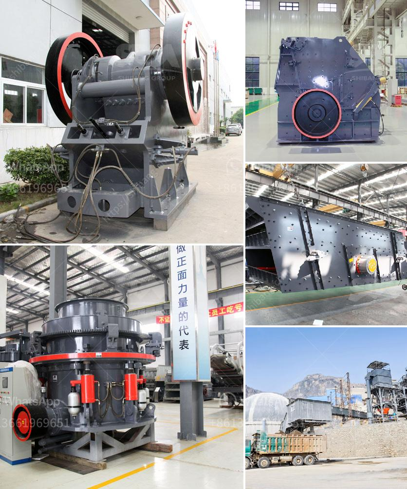

<h3>primary crusher meaning in hindi</h3>
प्राथमिक क्रशर द्वारा क्या तात्पर्य है?

प्राथमिक क्रशर वह मशीन होती है जिसे रॉक्स और अन्य संबंधित पदार्थों को टुकड़ों में तोड़ने के लिए उपयोग किया जाता है। इसका उपयोग चट्टानों, खदानों, निर्माण सामग्री, सड़कों, रेलवे लाइनों, इमारतों और अन्य निर्माण कार्यों में होता है। इसका प्रमुख लक्ष्य यह होता है कि शुरुआती स्तर पर उपयोग किया जाने वाला पदार्थ एक आवश्यक आकार में तोड़ा जा सके, जिसे बाद में और अवस्था में उपयोग के लिए प्रसंस्कृत करना संभव होता है।

प्राथमिक क्रशर को अक्सर "जॉ क्रशर" भी कहा जाता है, जो इसके उद्मेदारी पदार्थों की मोटाई को कम करने और उन्हें 150 मिलीमीटर से छोटे आकार की चट्टानों में तोड़ने के लिए उपयोगी होता है। यह मशीन स्थायीता, प्रदर्शन और मूल्य संबंधित मापदंडों के आधार पर विभिन्न आकारों में उपलब्ध होती है।

प्राथमिक क्रशर का काम करने का तरीका बहुत साधारण होता है। पहले से ही बाइपास चूंकरों और कक्षाओं का होता है, जहां परिष्कृत सामग्री स्थापित की जाती है। एक दो प्रिंगल मुहर्रिए होते हैं जो बीचों और अंदरी और बाहरी चक्रों में बंटे होते हैं। यह चक्र सुरंगों में उपस्थित बड़ी चट्टानों को चट्टानों में तोड़ने के लिए मुहर्री को यातायात मर्यादा में शुरू और आगे बढ़ाने के लिए सहायता करते हैं। चक्रों का तात्पर्य साफ होना चाहिए, क्योंकि वे चट्टानों की मोटाई आयाम में वर्ईयता प्रदर्शत करने के लिए बटरस्कॉच का उपयोग करते हैं। चट्टान को पथरी चक्कों में ट्रेवार्स कराने के लिए जोरदार मोटर, कामर्षियल वी-बेल्ट और पुली सिस्टम की आवश्यकता होती है।

प्राथमिक क्रशर कई विधियों में उपयोगी होती है। स्थायीता उठाने और सड़कों और निर्माण सामग्री पर संभवतः नकली आपूर्ति कम करने के लिए प्राथमिक क्रशर का उपयोग किया जाता है। साथ ही, चट्टानों को सुपरनत करने और उपयोग करने की प्रक्रियाओं के लिए भी इसका उपयोग किया जाता है। इसका महत्वपूर्ण उद्देश्य होता है कि पदार्थ जो प्रगट होता है वह कूपन लाइन के आसपास प्राथमिक क्रशर द्वारा तोड़ा जाए, जिससे कि उसे निर्माण सामग्री तैयार करने के लिए प्रसंस्कृत किया जा सके।

समारोह में, प्राथमिक क्रशर हिंदी भाषा में "प्राथमिक कुचलने यंत्र" के रूप में जाना जाता है। यह एक अहम और महत्वपूर्ण मशीन होती है जो विभिन्न निर्माण कार्यों में उपयोग की जाती है। इसकी मदद से शुरुआती स्तर पर पदार्थों को आवश्यकता के आकार और वर्तमान स्थिति में बदला जा सकता है।
<h3>Contact us</h3><ul><li><strong>Whatsapp:&nbsp;<a href="https://wa.me/8613661969651">+8613661969651</a></strong></li><li><a href="https://swt.shibang-china.com/?git&amp;zhl&amp;primary crusher meaning in hindi"><strong>Online Service(chat now)</strong></a></li></ul><h3>Related</h3><ul><li><a href='crusher for iron ore.md'>crusher for iron ore</a></li><li><a href='basalt crusher supplier.md'>basalt crusher supplier</a></li><li><a href='gold mining equipment stores in tanzania.md'>gold mining equipment stores in tanzania</a></li><li><a href='lm vertical grinding mills.md'>lm vertical grinding mills</a></li><li><a href='brick crushers for sale in australia.md'>brick crushers for sale in australia</a></li></ul>