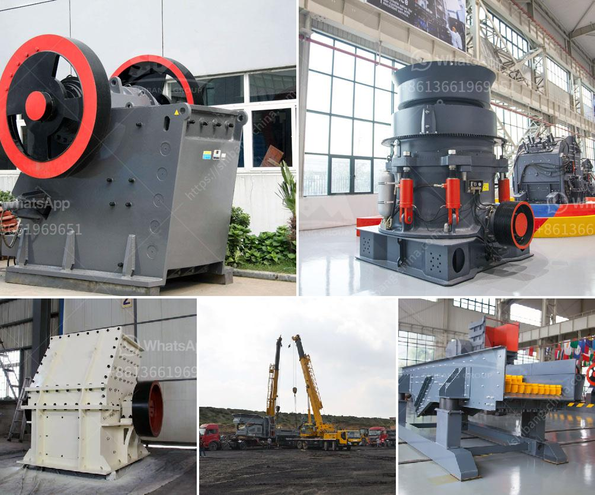

<h3>principles of granite quarry operations</h3>
Granite is an igneous rock formed deep underground over millions of years. Its durability, beauty, and versatility have made it a popular choice for construction and household purposes. However, the extraction of granite from quarries involves a complex and detailed process that requires adherence to several principles. These principles ensure that the quarry operates efficiently, sustainably, and with minimal impact on the environment.

First and foremost, the principle of safety is paramount in granite quarry operations. Quarry workers must follow strict guidelines and wear appropriate protective gear to prevent accidents and injuries. Regular maintenance and inspections of equipment and machinery are necessary to mitigate any potential hazards.

Environmental responsibility is another crucial principle in granite quarry operations. Sustainable practices, such as implementing erosion control measures and reducing water usage, are essential to minimize the impact on nearby ecosystems. Additionally, responsible waste management, including proper disposal of materials, plays a vital role in preserving the environment.

Efficiency is a key principle that governs granite quarry operations. Optimal utilization of resources, such as fuel, energy, and water, is necessary to ensure cost-effectiveness. Utilizing advanced machinery and technologies helps increase productivity while reducing the time required for quarry operations.

Adherence to quality control principles is essential to provide customers with high-quality granite products. Regular testing and inspection processes ensure that the extracted granite meets industry standards. Additionally, strict quality control procedures during manufacturing and processing guarantee consistent results.

Lastly, community engagement and communication are fundamental principles in granite quarry operations. Building positive relationships with the local community fosters trust and understanding. Regular meetings, open dialogue, and transparency regarding the quarry's operations help address any concerns and enhance social responsibility.

In conclusion, successful granite quarry operations are founded on several principles that prioritize safety, environmental responsibility, efficiency, quality control, and community engagement. By adhering to these principles, quarries can extract granite sustainably and responsibly, ensuring a steady supply of this beautiful and versatile rock for future generations.
<h3>Contact us</h3><ul><li><strong>Whatsapp:&nbsp;<a href="https://wa.me/8613661969651">+8613661969651</a></strong></li><li><a href="https://swt.shibang-china.com/?git&amp;zhl&amp;principles of granite quarry operations"><strong>Online Service(chat now)</strong></a></li></ul><h3>Related</h3><ul><li><a href='hammer mill in bogota.md'>hammer mill in bogota</a></li><li><a href='dolomite processing equipment.md'>dolomite processing equipment</a></li><li><a href='pebble stone crusher.md'>pebble stone crusher</a></li><li><a href='crushing plant supplier.md'>crushing plant supplier</a></li><li><a href='sand and gravel crushers machine.md'>sand and gravel crushers machine</a></li></ul>