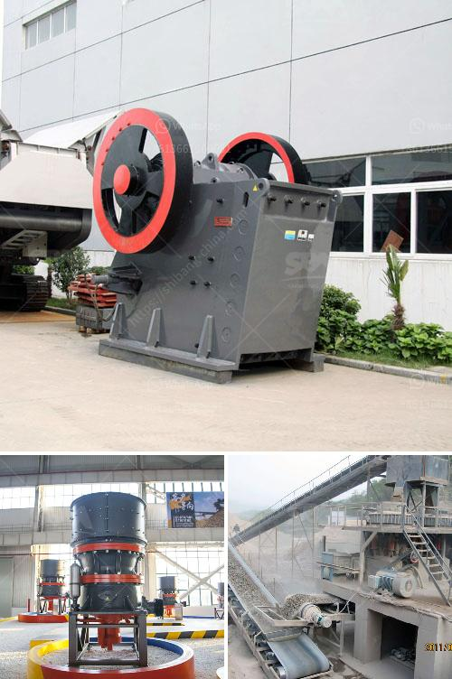

<h3>process chart of sand washing plant</h3>
A sand washing plant is designed to process sand by cleaning, washing, and dewatering the sand particles, making it fit for various industrial applications. The washing process is usually carried out through the evaporation of water using various methods, such as mechanical scrubbing, attrition scrubbing, and chemical cleaning.

The sand washing plant usually consists of various equipment, such as screening equipment, sand washing equipment, and dewatering equipment. Each equipment plays a crucial role in the washing process, ensuring the sand is clean and free from impurities.

The first step in the process is the screening of the raw sand to remove any oversized particles. This is usually done using vibrating screens or trommel screens, which separate the sand into different sizes. The oversized particles are then sent to a crusher to be broken down into smaller sizes, while the correctly sized particles move on to the next step.

After screening, the sand is fed into a sand washing machine or a bucket wheel sand washer to remove the impurities. The impurities can include clay, silt, and organic matter, which can affect the quality of the sand. In the washing machine, the sand is mixed with water, and the rotating impeller stir and scrub the sand to remove the impurities. The water and impurities are then discharged through an outlet, while the clean sand is collected in a tank.

In some cases, if the sand contains a high percentage of clay or other stubborn impurities, additional steps may be required. This can include attrition scrubbing, where the sand is agitated with water and chemicals to break down the impurities. The scrubbed sand is then washed again in the sand washing machine to remove any remaining impurities.

Once the sand is clean, it is then dewatered using dewatering equipment, such as a dewatering screen or a filter press. These equipment remove excess water from the sand, reducing its moisture content and making it suitable for different applications. The dewatered sand is then stockpiled or transported for further processing, depending on its intended use.

The entire process of a sand washing plant is typically automated, with various sensors and controls to monitor and regulate the operations. This ensures that the washing process is efficient and consistent, producing high-quality sand with minimal wastage.

In conclusion, a sand washing plant is a crucial facility in the production of clean and usable sand for various applications. The process involves screening, washing, scrubbing, and dewatering the sand, ensuring it is free from impurities and suitable for use. With advanced equipment and automation, sand washing plants can efficiently and effectively process large quantities of sand, meeting the demand for clean and quality sand in various industries.
<h3>Contact us</h3><ul><li><strong>Whatsapp:&nbsp;<a href="https://wa.me/8613661969651">+8613661969651</a></strong></li><li><a href="https://swt.shibang-china.com/?git&amp;zhl&amp;process chart of sand washing plant"><strong>Online Service(chat now)</strong></a></li></ul><h3>Related</h3><ul><li><a href='aggregates crushers for sale.md'>aggregates crushers for sale</a></li><li><a href='cost of cement plant.md'>cost of cement plant</a></li><li><a href='roller mill spaider.md'>roller mill spaider</a></li><li><a href='coal manufacturing machine price in malaysia.md'>coal manufacturing machine price in malaysia</a></li><li><a href='stone crushers manufacturer.md'>stone crushers manufacturer</a></li></ul>