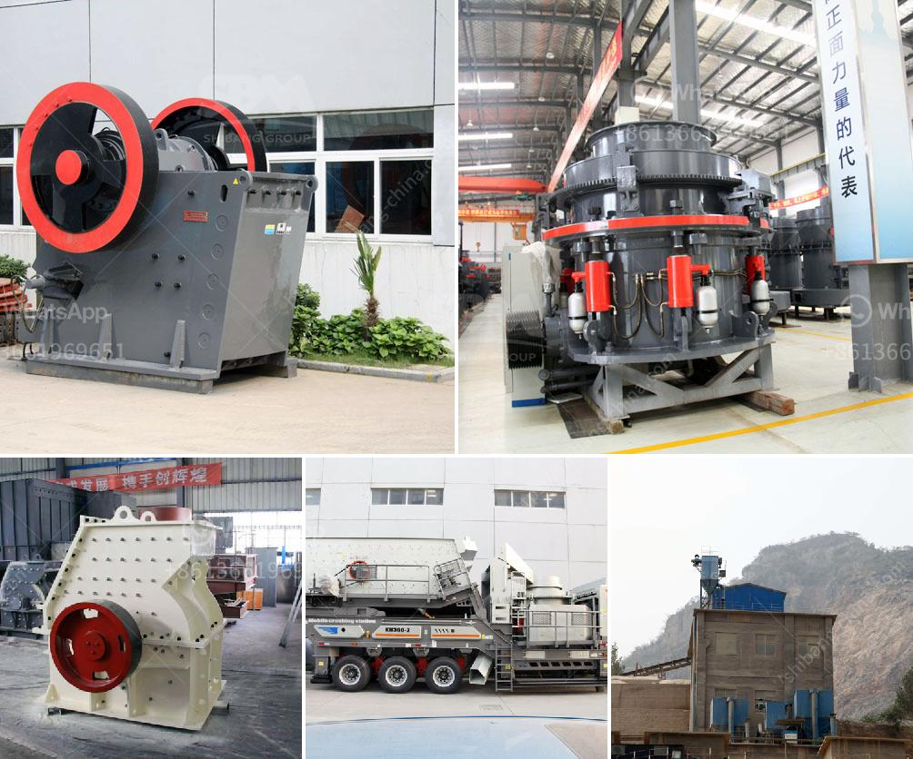

<h3>process flow diagram for kaolin calcining using kiln</h3>
Kaolin calcination is a process used to remove impurities from raw kaolin clay, such as organic matter, volatile gases, and sulfur compounds. The technique enhances the whiteness, brightness, and opacity of the kaolin, making it more suitable for use in various industries like ceramics, paper, and paints. Kiln is a widely used equipment for kaolin calcination, providing controlled heat treatment to achieve the desired results. In this article, we will discuss the process flow diagram for kaolin calcining using a kiln.

The process begins with the excavation of kaolin clay from underground mines or surface pits. The clay is then transported to a grinding mill where it is crushed and mixed with water to form a slurry. The slurry is then pumped into a series of hydrocyclones, which remove impurities like sand, mica, and other minerals. The resulting purified kaolin slurry is then sent to a storage tank.

From the storage tank, the kaolin slurry is transferred to a rotary kiln. The kiln is a long cylindrical vessel, tilted at a slight angle and equipped with burners that provide heat to induce calcination. Inside the kiln, the kaolin slurry is heated to temperatures between 950 to 1050 degrees Celsius. The exposure to high temperatures triggers chemical reactions that eliminate volatile gases, oxidize organic matter, and transform the kaolin crystal structure.

The kiln is divided into several zones, each serving a specific purpose in the calcination process. The first zone, known as the drying zone, removes moisture from the kaolin slurry as it enters the kiln. The slurry gradually moves towards the combustion zone, where the burners provide a continuous flow of hot gases. These gases increase the temperature inside the kiln, initiating the calcination reactions.

As the kaolin slurry progresses further through the kiln, it reaches the sintering zone. In this zone, the temperature is at its peak, enabling the crystallization of the kaolin particles. The sintering process results in the formation of metakaolin, a highly reactive mineral with improved properties. The metakaolin then moves towards the cooling zone, where it gradually cools down.

To enhance the efficiency of the calcination process, many kilns are equipped with a heat recovery system. This system uses the waste heat from the kiln to generate steam or hot water, which can be utilized to generate electricity or for other industrial processes. By utilizing this waste heat, the overall energy consumption of the calcination process can be significantly reduced.

After the kaolin has cooled down, it is discharged from the kiln and sent for further processing. The calcined kaolin can be subjected to additional treatments like air classification, deagglomeration, and magnetic separation to obtain the desired particle size and purity. The final product is then packed and shipped to customers.

In conclusion, the process flow diagram for kaolin calcining using a kiln involves several stages, including grinding, purification, kiln drying, calcination, and cooling. The kiln plays a vital role in the calcination process by providing controlled heating and ensuring the desired level of impurity removal. Kaolin calcination using a kiln is an effective method to enhance the quality and marketability of kaolin clay for various industrial applications.
<h3>Contact us</h3><ul><li><strong>Whatsapp:&nbsp;<a href="https://wa.me/8613661969651">+8613661969651</a></strong></li><li><a href="https://swt.shibang-china.com/?git&amp;zhl&amp;process flow diagram for kaolin calcining using kiln"><strong>Online Service(chat now)</strong></a></li></ul><h3>Related</h3><ul><li><a href='price of a set of stone crushing machine.md'>price of a set of stone crushing machine</a></li><li><a href='for sale prices jaw crushe.md'>for sale prices jaw crushe</a></li><li><a href='crusher plant saudi.md'>crusher plant saudi</a></li><li><a href='bauxite mining process flow chart germany.md'>bauxite mining process flow chart germany</a></li><li><a href='50tpd mini cement plant cost in india.md'>50tpd mini cement plant cost in india</a></li></ul>