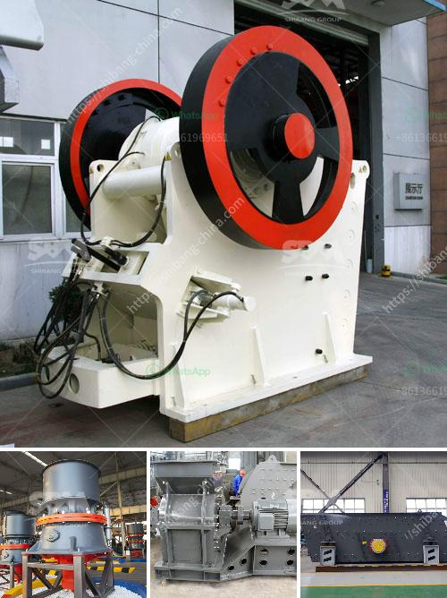

<h3>process flow of bajri washing plant</h3>
A Bajri washing plant is a facility designed to remove impurities such as clay, dust, and fines from the Bajri (gravel) that is used in construction. This process ensures that the Bajri meets the required quality standards and is suitable for various construction applications.

The process flow of a Bajri washing plant involves several stages. First, the raw Bajri is transported to the plant site, either from a nearby mine or a supplier. Once it arrives, it is unloaded and fed into a hopper, which acts as a storage and feeding unit.

From the hopper, the Bajri is then transferred to a vibrating feeder or a conveyor belt, which evenly distributes the material onto a screen. This screen helps to remove larger stones and oversized particles from the Bajri. Any material that exceeds the set size limit is rejected and sent for further crushing or processing.

The screened Bajri passes through a washer, where it is mixed with water and agitated to remove clay, dust, and other impurities. The washing process helps to separate the contaminants from the Bajri and makes it cleaner and more consistent in size and quality.

Once the Bajri is washed, it is then transported through a series of conveyors or chutes to a drying unit. This unit can be a rotary dryer, where hot air is circulated to remove the excess moisture from the Bajri. The dried Bajri is then transferred to a storage area or directly loaded onto trucks for transportation to construction sites.

In some cases, the Bajri washing plant may also include additional stages such as crushing, screening, and classification, depending on the specific requirements of the project. These additional stages help to further improve the quality and consistency of the Bajri.

Overall, a Bajri washing plant ensures that the Bajri used in construction is free from impurities and meets the required quality standards. This process flow helps to produce clean and high-quality Bajri that contributes to the strength and durability of construction projects.
<h3>Contact us</h3><ul><li><strong>Whatsapp:&nbsp;<a href="https://wa.me/8613661969651">+8613661969651</a></strong></li><li><a href="https://swt.shibang-china.com/?git&amp;zhl&amp;process flow of bajri washing plant"><strong>Online Service(chat now)</strong></a></li></ul><h3>Related</h3><ul><li><a href='crusher price south africa.md'>crusher price south africa</a></li><li><a href='all model vsi crusher.md'>all model vsi crusher</a></li><li><a href='mining calcium carbonate vietnam.md'>mining calcium carbonate vietnam</a></li><li><a href='latest stone crusher machine price india.md'>latest stone crusher machine price india</a></li><li><a href='aggregates crushing plant in angat bulacan.md'>aggregates crushing plant in angat bulacan</a></li></ul>