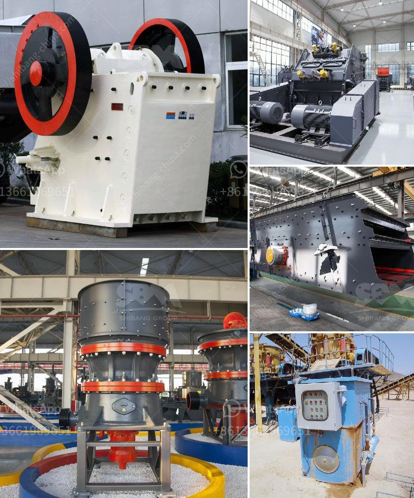

<h3>process of cement making</h3>
The production of cement is a complex and energy-intensive process. In the past, cement production used to be a simple process in which limestone and clay were mixed, fired, and ground to produce cement clinker. With advancements in technology, the cement manufacturing process has become more sophisticated, enabling a higher quality and more sustainable product.

The first step in cement production is the extraction of raw materials. Typically, limestone, shells, and chalk or marl, along with clay, shale, or slate, are mined from quarries. These materials are then transported to the cement plant, where they are crushed and grounded to create a fine powder. 

Next, the raw materials are preheated and partially calcined in a preheater and precalciner system, which further dry and decompose them. This step significantly reduces the energy required in the kiln process, as the heat generated during calcination is used to preheat the materials. 

The preheated materials are then fed into a rotary kiln, a large cylindrical furnace lined with refractory bricks. The kiln is heated from one end to temperatures of around 1,500°C. This high temperature causes the raw materials to undergo a series of complex chemical reactions, resulting in the formation of cement clinker. The clinker is a nodular material with a size range of 2 to 25 mm.

After leaving the kiln, the clinker is cooled rapidly, using air or water cooling, to prevent its reactivity. The cooled clinker is then ground into a fine powder with the addition of gypsum (calcium sulfate) to regulate setting time. This powdered material is known as cement.

To enhance the properties of cement, supplementary materials such as fly ash, slag, or limestone can be added during the grinding process. These materials not only improve the durability and strength of the final product but also reduce the carbon footprint of cement production by utilizing industrial by-products.

Finally, the cement is packed into bags or shipped in bulk to distribution centers and construction sites. At the construction site, cement is mixed with aggregates, such as sand and gravel, and water, to produce concrete – one of the most widely used construction materials. 

The cement manufacturing process is energy-intensive and has a significant environmental impact. The kiln process, in particular, emits large amounts of greenhouse gases, mainly carbon dioxide. To minimize these emissions, cement plants employ various strategies, such as using alternative fuels like biomass and waste, and adopting more efficient kiln technologies.

Additionally, efforts are being made to develop innovative cement production methods that can capture and store carbon dioxide emissions. These technologies, known as carbon capture, utilization, and storage (CCUS), have the potential to significantly reduce the environmental impact of cement production.

In conclusion, while the cement manufacturing process has evolved over time, it remains a complex and resource-intensive process. From the extraction of raw materials to the final product, every step requires careful considerations to ensure a high-quality cement that meets the demands of the construction industry. As the world moves towards sustainability, further advancements in technology and increased focus on reducing emissions will continue to shape the future of cement production.
<h3>Contact us</h3><ul><li><strong>Whatsapp:&nbsp;<a href="https://wa.me/8613661969651">+8613661969651</a></strong></li><li><a href="https://swt.shibang-china.com/?git&amp;zhl&amp;process of cement making"><strong>Online Service(chat now)</strong></a></li></ul><h3>Related</h3><ul><li><a href='quarry crusher plant machinery.md'>quarry crusher plant machinery</a></li><li><a href='buy stone crusher.md'>buy stone crusher</a></li><li><a href='jaw crushers for sale in zimbabwe.md'>jaw crushers for sale in zimbabwe</a></li><li><a href='manufacturing and processing plant.md'>manufacturing and processing plant</a></li><li><a href='large capacity jaw crusher machines sales to india.md'>large capacity jaw crusher machines sales to india</a></li></ul>