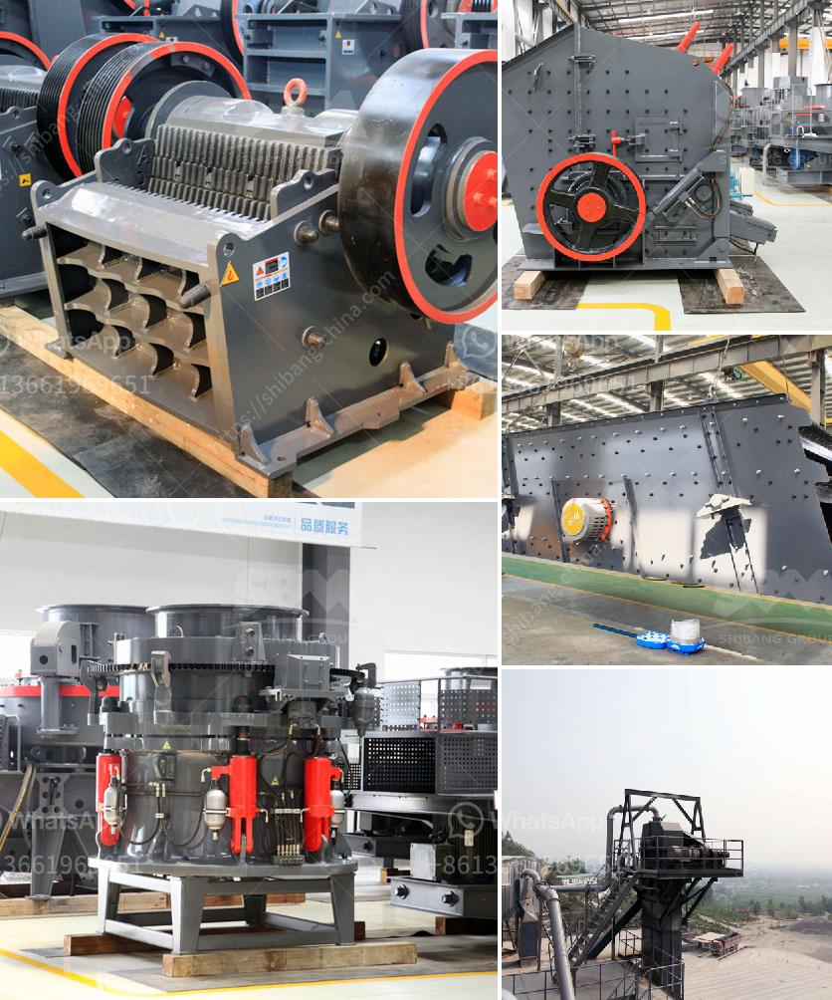

<h3>process of making quartz marble crusher</h3>
Quartz marble is a beautiful engineered stone that combines the durability of quartz with the elegance of marble. While it is readily available in the market in various forms, including slabs and tiles, you may also consider making your own quartz marble crusher for a unique touch. In this article, we will guide you through the process of making a quartz marble crusher.

1. Quartz marble slab: Choose a high-quality quartz marble slab that fits your desired crusher size and design. You can find a wide range of options at stone suppliers.

2. Diamond saw or wet tile saw: This tool is crucial for cutting the quartz marble slab accurately. Ensure that you have a sharp diamond blade suitable for cutting stones.

3. Sandpaper or sanding discs: Depending on the desired finish, you may need sandpaper or sanding discs of different grits to give your crusher a smooth and polished appearance.

4. Epoxy adhesive: Select a durable epoxy adhesive that is specifically designed for bonding stone. This adhesive will ensure the strength and stability of your crusher.

5. Clamp or vice: A clamp or vice will be useful for holding the quartz marble slab in place during the cutting and bonding process.

Now that you have gathered all the necessary materials and tools, you can start the process of making your own quartz marble crusher:

1. Measure and mark: Use a ruler, measuring tape, and marker to measure and mark the desired dimensions of your crusher on the quartz marble slab. Consider factors such as the size of the crushing area and the overall design.

2. Cut the slab: Following the marked dimensions, use a diamond saw or wet tile saw to cut the quartz marble slab carefully. Take your time to ensure accurate and clean cuts.

3. Refine the edges: Use sandpaper or sanding discs to smooth and refine the edges of your quartz marble crusher. Start with a rough grit and gradually move to finer grits for a polished finish.

4. Bond the pieces: Apply a generous amount of epoxy adhesive on the edges of the quartz marble pieces that need to be bonded together. Press the pieces firmly together, ensuring a secure bond. Use a clamp or vice to hold the pieces in place until the epoxy cures.

5. Finishing touches: Once the epoxy has cured, check for any rough edges or uneven surfaces. Use sandpaper or sanding discs to smooth and polish the surface of your crusher. Wipe off any dust or debris.

Congratulations! You have successfully made your own quartz marble crusher. Admire your creation and test its functionality by crushing small objects. You now have a unique and personalized piece that combines the elegance of marble with the strength of quartz.

Creating a quartz marble crusher can be a rewarding and fulfilling DIY project. The process allows you to add a personal touch to your home or office while showcasing your creativity. Enjoy the beauty and functionality of your handmade quartz marble crusher for years to come!
<h3>Contact us</h3><ul><li><strong>Whatsapp:&nbsp;<a href="https://wa.me/8613661969651">+8613661969651</a></strong></li><li><a href="https://swt.shibang-china.com/?git&amp;zhl&amp;process of making quartz marble crusher"><strong>Online Service(chat now)</strong></a></li></ul><h3>Related</h3><ul><li><a href='grinding of limestone for cement production.md'>grinding of limestone for cement production</a></li><li><a href='cement plant machine.md'>cement plant machine</a></li><li><a href='stone crushing production line zenith.md'>stone crushing production line zenith</a></li><li><a href='latest stone crusher machine price india.md'>latest stone crusher machine price india</a></li><li><a href='quartz powder manufacturing machinery.md'>quartz powder manufacturing machinery</a></li></ul>