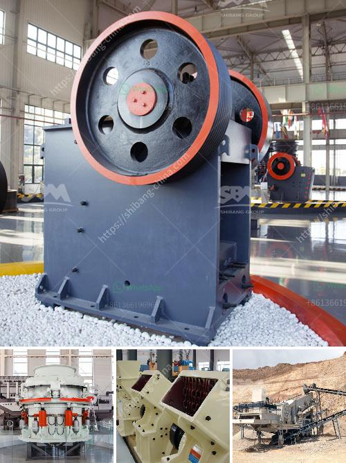

<h3>process of roll milling</h3>
Roll milling, also known as roller milling, is a process widely used in the processing industry that entails reducing materials into fine particles. This technique has numerous applications across various sectors, including food processing, pharmaceuticals, and chemical manufacturing. By employing a combination of compression, friction, and shear forces, roll milling can efficiently and effectively refine and grind materials to the desired specifications.

The process of roll milling involves the use of two or more cylindrical rollers that rotate in opposite directions at different speeds. The gap between the rollers, known as the roll gap, can be adjusted to control the size of the resulting particles. As the material is fed through the roll gap, it experiences various forces that break it down into smaller fragments.

One of the key advantages of roll milling is its ability to produce uniform particles. This is achieved through the use of corrugations or ridges on the surface of the rollers, which create more points of contact and thus enhance the grinding action. Additionally, the adjustable roll gap allows for precise control over the particle size distribution, ensuring consistent and reproducible results.

The size reduction mechanism in roll milling primarily involves compression, friction, and shear forces. When the material is fed into the roll gap, it is compressed between the rollers due to the narrowing gap, resulting in the fragmentation and reduction in particle size. Frictional forces generated by the movement of the rollers against the material also contribute to the grinding action. Finally, shear forces occur when the material is subjected to opposing forces that cause it to deform and break apart.

The efficiency and effectiveness of the roll milling process depend on several factors, including the roller speed, roll gap, and material characteristics. These parameters need to be carefully adjusted to achieve the desired particle size and consistency. Higher roller speeds tend to generate more shear forces, resulting in finer particles. Conversely, a wider roll gap allows for larger particles to pass through, reducing the grinding action. Material properties, such as hardness and moisture content, can also influence the milling process.

Roll milling is widely used across various industries for different purposes. In the food industry, it is employed to produce flour, refine sugar, and grind spices. In the pharmaceutical sector, it is utilized to reduce the particle size of active pharmaceutical ingredients (APIs) for better dissolution and absorption. The chemical manufacturing industry uses roll milling for grinding pigments, producing fine powders, and preparing dispersions.

In conclusion, roll milling is a versatile and efficient process for reducing materials into fine particles. By employing compressive, frictional, and shear forces, it can grind and refine materials to the desired specifications. With its ability to achieve uniform particle size and precise control over the final product, roll milling finds applications across various industries, including food processing, pharmaceuticals, and chemical manufacturing.
<h3>Contact us</h3><ul><li><strong>Whatsapp:&nbsp;<a href="https://wa.me/8613661969651">+8613661969651</a></strong></li><li><a href="https://swt.shibang-china.com/?git&amp;zhl&amp;process of roll milling"><strong>Online Service(chat now)</strong></a></li></ul><h3>Related</h3><ul><li><a href='raymond hammer mill.md'>raymond hammer mill</a></li><li><a href='prices for stone crushing machine south africa.md'>prices for stone crushing machine south africa</a></li><li><a href='mining machinery companies in germany.md'>mining machinery companies in germany</a></li><li><a href='crushing machine from china.md'>crushing machine from china</a></li><li><a href='primary and secondary crusher.md'>primary and secondary crusher</a></li></ul>