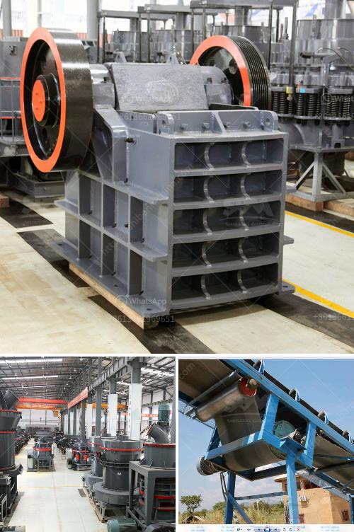

<h3>processing of copper crusher</h3>
Copper ore is mined either at open pit copper ore mines or underground copper ore mines. First the copper ore is blasted, loaded and transported to the primary crushers. Then the ore is crushed and screened, with the fine sulfide ore (~-0.5 mm) going to froth flotation cells for recovery of copper.

In the primary crusher, the ore is broken into smaller pieces of less than 25 centimeters in diameter. During the crushing process, SBM is a professional copper ore crusher supplier, and our copper ore crushing equipment mainly consists of jaw crusher which always as the primary crusher, jaw crusher is the commonly used as primary crushing equipment, because it can crush many kinds of material for its crushing principle of lamination protect which crush materials by the action of two jaw plates.

The copper crusher plant involved in production line includes jaw crusher, impact crusher, cone crusher, hammer crusher, gyratory crusher, and mobile crusher. Stone crushing plant, Ore grinding plant is also widely used in the quarrying plant, and processing plant like the limestone crushing plant, basalt crushing plant, chrome ore crushing plant, copper ore crusher, and manganese ore crushing plant. The mainstream gold ore dressing technology is generally with the ore dressing equipment (crusher) to broken gold ore, and then sent it to the gold beneficiation (ball mill) to be smashed and grinded.

The copper crusher plant involved in production line includes jaw crusher, impact crusher, cone crusher, hammer crusher, gyratory crusher, and mobile crusher, stone crushing plant, ore grinding plant etc. SBM is a professional copper ore crusher supplier, and our copper ore crushing equipment mainly consists of jaw crusher which always as the primary crusher, jaw crusher is the commonly used as primary crushing equipment, because it can crush many kinds of material for its crushing principle of lamination protect which crush materials by the action of two jaw plates. We provide PE jaw crusher for sale. Flotation Production Line can be used for copper ore, lead and zinc ore, fluorite ore, feldspar ore, graphite ore, tungsten ore, etc. Flotation separating process-beneficiation production line flotation process is one of the most widely beneficiation methods of gold ore, which is commonly used in the treatment of high-fluorite and sulfide ore.

After the initial crushing process of copper ore, copper ore particles should be further reduced in size by grinding. Grinding is an essential stage in the copper production process, as it can improve the grade of concentrate. Copper particles that are too large to pass through the vibrating screen will be sent back to the cone crusher for re-crushing. The grinding stage usually uses ball mill or grinding mill to grind crushed materials into powder.

The final copper particles should be processed by magnetic separation and flotation to remove impurities. Then the copper concentrate is dried and sent to the smelting furnace for further heating and reaction. The resulting copper matte is then tapped into ladles, cooled, and made into copper plates ready for shipment.

In conclusion, the processing of copper crusher involves multiple stages and various types of machines. To succeed in the copper mining industry, it is necessary to choose the best processing method and equipment for every unique mining operation. Only with the right equipment can the efficiency and quality of copper processing be improved.
<h3>Contact us</h3><ul><li><strong>Whatsapp:&nbsp;<a href="https://wa.me/8613661969651">+8613661969651</a></strong></li><li><a href="https://swt.shibang-china.com/?git&amp;zhl&amp;processing of copper crusher"><strong>Online Service(chat now)</strong></a></li></ul><h3>Related</h3><ul><li><a href='malaysia ball mill.md'>malaysia ball mill</a></li><li><a href='rock gypsum buyers in china.md'>rock gypsum buyers in china</a></li><li><a href='suppliers kenya crusher.md'>suppliers kenya crusher</a></li><li><a href='washing machines detailed diagrams.md'>washing machines detailed diagrams</a></li><li><a href='magnetic separator conveyor indonesia.md'>magnetic separator conveyor indonesia</a></li></ul>