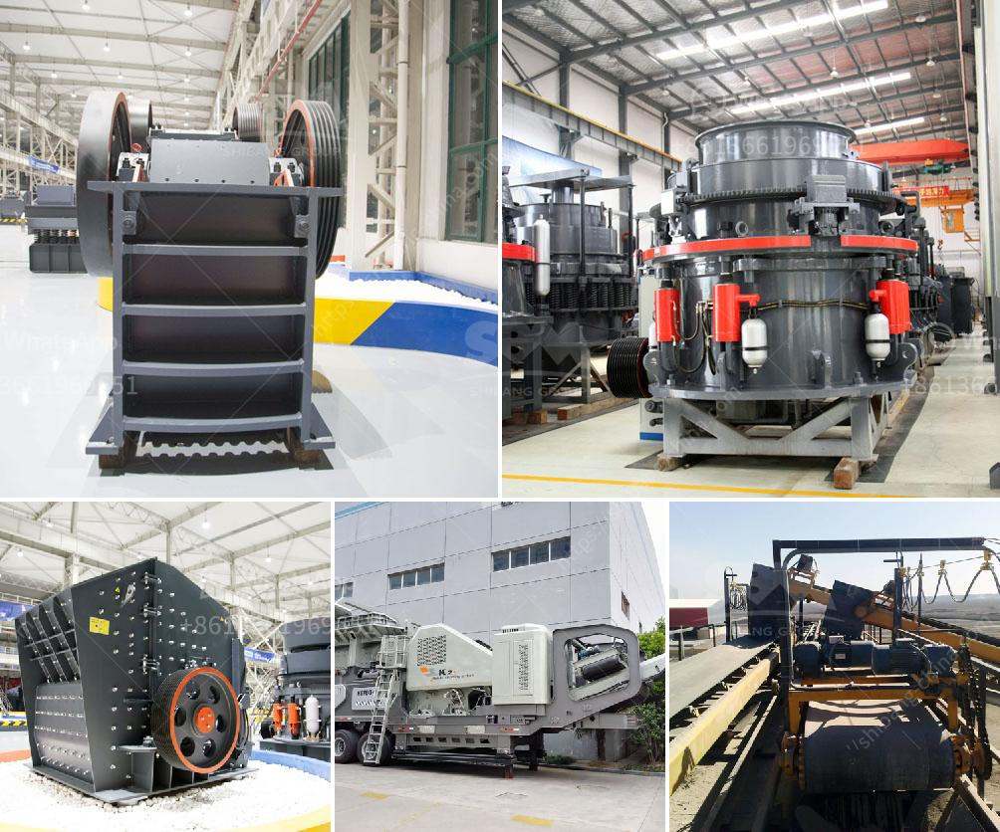

<h3>processing of delomite powder mill</h3>
Dolomite is a natural mineral that has played a pivotal role in the construction industry for centuries. It is a sedimentary rock formed by the deposition of calcium magnesium carbonate. The prevalence of dolomite has made it an essential ingredient in various industrial applications, including cement, ceramics, glass, steel, and agriculture. To utilize dolomite efficiently, it needs to undergo processing in a dolomite powder mill.

The processing of dolomite powder involves several stages to achieve the desired particle size, purity, and whiteness. These stages include crushing, grinding, and classifying. Each stage contributes to the overall quality of the final product.

The first step in the processing of dolomite is crushing. Large chunks of dolomite ore are initially broken down into smaller fragments to facilitate the subsequent grinding process. This can be accomplished using a variety of crushers, such as jaw crushers, impact crushers, or cone crushers. The choice of crusher depends on the size of the dolomite fragments and the desired particle size for the final product.

After crushing, the dolomite fragments are further processed in a grinding mill. The grinding mill grinds the crushed dolomite into a fine powder that meets the required particle size. There are various types of grinding mills available for the processing of dolomite, including ball mills, Raymond mills, vertical mills, and ultrafine mills. The selection of the grinding mill depends on the specific requirements of the application, such as the desired fineness and capacity.

The next step in the processing of dolomite powder is classification. Classification involves separating the fine powder into different particle sizes to meet specific requirements. This is typically achieved using air classifiers or sieving equipment. The classified dolomite powder is then collected and stored for further use.

One key consideration in the processing of dolomite powder is the purity and whiteness of the final product. The presence of impurities can affect the performance and suitability of the powder for different applications. To ensure high purity and whiteness, additional processes, such as magnetic separation or flotation, may be employed. These processes help remove impurities and improve the quality of the final product.

Moreover, dolomite powder processing also involves other auxiliary equipment. For instance, dust collectors are essential to capture and remove any airborne particles generated during the crushing and grinding processes. These dust collectors prevent environmental pollution and ensure a safe working environment.

In conclusion, the processing of dolomite powder requires various stages to achieve the desired particle size, purity, and whiteness. The steps involve crushing, grinding, and classifying, with additional processes to improve the final product's quality. Dolomite powder mills offer the capability to process dolomite efficiently, making it suitable for a wide range of industrial applications. The utilization of dolomite powder enhances the performance and durability of various products, making it an essential component in many industries.
<h3>Contact us</h3><ul><li><strong>Whatsapp:&nbsp;<a href="https://wa.me/8613661969651">+8613661969651</a></strong></li><li><a href="https://swt.shibang-china.com/?git&amp;zhl&amp;processing of delomite powder mill"><strong>Online Service(chat now)</strong></a></li></ul><h3>Related</h3><ul><li><a href='jual jaw crusher second hand.md'>jual jaw crusher second hand</a></li><li><a href='gypsum powder uses in construction.md'>gypsum powder uses in construction</a></li><li><a href='mica crusher production plants.md'>mica crusher production plants</a></li><li><a href='cement plants in west bengal list.md'>cement plants in west bengal list</a></li><li><a href='used machines philippines ball mill.md'>used machines philippines ball mill</a></li></ul>