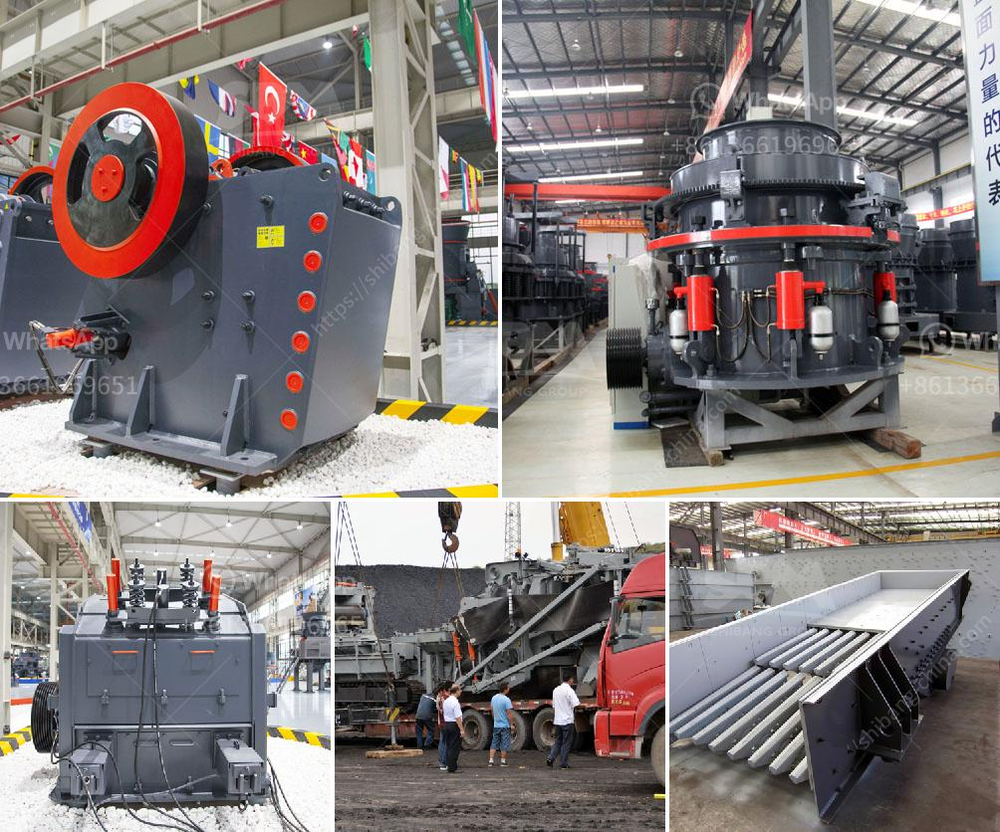

<h3>production quarzt sand machine</h3>
Quartz sand, also known as silica sand, is a very important industrial raw material. It is widely used in glass, ceramics, metallurgy, construction, chemicals, machinery, electronics, and other industries. With its high purity, high hardness, uniform particle size, and other excellent characteristics, quartz sand has become an indispensable material in many fields.

To meet the growing demand for quartz sand, manufacturers have started looking for more efficient and reliable production machines. One such machine that has gained popularity is the quartz sand production machine.

A quartz sand production machine is a device that applies mechanical force to crush quartz stones to produce sand. Quartz sand is an important industrial mineral raw material, which is widely used in glass, casting, ceramics, and refractories after being processed. Therefore, the choice of quartz sand production equipment is critical.

One of the key factors to consider when choosing a quartz sand production machine is efficiency. An efficient machine can produce sand at a higher rate, reducing production time and cost. Additionally, it ensures a consistent output of high-quality sand, which is crucial for various applications.

Reliability is another crucial aspect when selecting a quartz sand production machine. The machine should be designed to withstand heavy usage and operate without frequent breakdowns. This ensures a continuous and uninterrupted production process, minimizing downtime and increasing overall productivity.

Moreover, a reliable quartz sand production machine should have a low maintenance requirement. Regular maintenance can be time-consuming and expensive, impacting production costs. Therefore, a machine that is easy to maintain and has readily available spare parts is highly desirable.

Another important consideration is the environmental impact of the machine. As the demand for sustainable and eco-friendly practices grows, it is essential to choose a quartz sand production machine that minimizes energy consumption and reduces emissions. Opting for a machine with advanced technology and energy-efficient features can help meet environmental regulations and also save operational costs in the long run.

The design of the machine should also prioritize user-friendliness. Operators should be able to easily control and adjust the production process. Additionally, safety features should be incorporated to protect workers from hazards during operation.

In conclusion, a reliable quartz sand production machine is essential for manufacturers in various industries. It should be efficient, reliable, easy to maintain, environmentally friendly, and user-friendly. Investing in a high-quality machine will not only ensure a steady supply of quartz sand but also contribute to increased profitability and competitiveness in the market.
<h3>Contact us</h3><ul><li><strong>Whatsapp:&nbsp;<a href="https://wa.me/8613661969651">+8613661969651</a></strong></li><li><a href="https://swt.shibang-china.com/?git&amp;zhl&amp;production quarzt sand machine"><strong>Online Service(chat now)</strong></a></li></ul><h3>Related</h3><ul><li><a href='hammer mill manufacturer in tamilnadu.md'>hammer mill manufacturer in tamilnadu</a></li><li><a href='ethiopia crusher jaw crusher.md'>ethiopia crusher jaw crusher</a></li><li><a href='pulverizing ball mills suppliers.md'>pulverizing ball mills suppliers</a></li><li><a href='rock crushers cost tons per hour.md'>rock crushers cost tons per hour</a></li><li><a href='vibratory screen south africa.md'>vibratory screen south africa</a></li></ul>