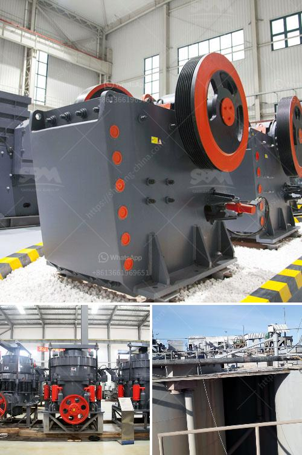

<h3>production rate limestone crusher</h3>
A limestone crusher, also known as a stone crusher, is the equipment designed to reduce the size of limestone from large blocks into smaller pieces of rock. These crushed limestone pieces are then used for various purposes in several industries.

With a production rate between 100 and 300 tons per hour, the limestone crusher can meet your demands for different capacities. The limestone crusher can crush the limestone to a specified size and also removes unwanted materials, such as soil and rock, from the final product.

The efficiency and productivity of the limestone crusher depend on several factors. Firstly, the type of limestone crusher plays a crucial role. Different types of crushers, such as jaw crushers, cone crushers, or impact crushers, have different crushing capacities and operational costs. Choosing the right type of crusher for your specific needs is important to maximize productivity.

Another factor affecting the production rate of the limestone crusher is the hardness of the rock. Harder rocks require more energy and time to crush, which can reduce the overall production rate. Therefore, it's essential to consider the hardness of the limestone when selecting the crusher and adjust the operational variables accordingly.

The operational variables, such as the crusher's speed, closed-side setting (CSS), and feed rate, also impact the production rate. A higher crusher speed and larger CSS result in higher production rates. Similarly, increasing the feed rate can boost the productivity of the crusher.

Regular maintenance and proper care of the limestone crusher are also essential for maximizing its production rate. Routine inspection, lubrication, and replacing worn-out parts can help prevent breakdowns and ensure optimal performance.

In conclusion, a limestone crusher with a production rate between 100 and 300 tons per hour offers high operational efficiency and flexibility. Choosing the right type of crusher, considering the rock's hardness, and adjusting the operational variables are key factors to achieve a productive limestone crushing process. Regular maintenance and care of the crusher also contribute to its overall performance and longevity.
<h3>Contact us</h3><ul><li><strong>Whatsapp:&nbsp;<a href="https://wa.me/8613661969651">+8613661969651</a></strong></li><li><a href="https://swt.shibang-china.com/?git&amp;zhl&amp;production rate limestone crusher"><strong>Online Service(chat now)</strong></a></li></ul><h3>Related</h3><ul><li><a href='concrete crusher for rent qatar.md'>concrete crusher for rent qatar</a></li><li><a href='pulveriser quartzite china make.md'>pulveriser quartzite china make</a></li><li><a href='magnetic separator conveyor indonesia.md'>magnetic separator conveyor indonesia</a></li><li><a href='portable concrete crusher south africa.md'>portable concrete crusher south africa</a></li><li><a href='granite stones crusher.md'>granite stones crusher</a></li></ul>