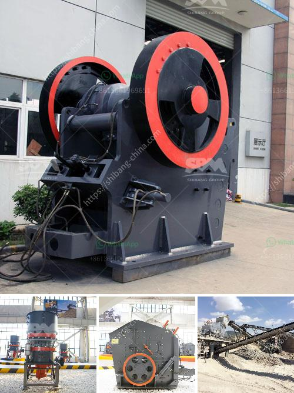

<h3>products scm ultrafine mill</h3>
In the era of industrial development, efficient machinery plays a crucial role in maximizing productivity and delivering superior quality products. SCM Ultrafine Mill is one such advanced equipment that has revolutionized the grinding process. With its remarkable capabilities and outstanding performance, this mill has become a top choice for industries across various sectors.

The SCM Ultrafine Mill is designed and manufactured by leading experts in the field of grinding and milling machinery. It is widely used for processing various minerals and materials with Mohs hardness below 9.3 and humidity below 6%. This mill is particularly suitable for grinding non-flammable and non-explosive materials such as graphite, talc, limestone, bentonite, and other ores.

One of the key features that make SCM Ultrafine Mill stand out is its high production capacity. The mill is equipped with an efficient and powerful motor that enables it to process a significant amount of material at a faster rate compared to traditional grinding mills. This means that industries can achieve higher production volumes in less time, ultimately leading to increased profitability.

Another remarkable aspect of the SCM Ultrafine Mill is its ability to produce ultra-fine powder. The mill utilizes a unique grinding principle, which involves multiple grinding rollers and a ring. This design ensures that the material is finely ground into particles as small as 325-2500 mesh. This level of fineness is highly desirable for industries such as cosmetics, pharmaceuticals, and chemicals, where the quality of the product directly depends on its particle size.

Furthermore, the SCM Ultrafine Mill offers exceptional stability and reliability. Its robust construction and high-quality components ensure a long service life with minimal downtime. Additionally, the mill is equipped with an advanced control system that allows for precise adjustment and monitoring of various parameters such as grinding pressure, speed, and particle size.

The SCM Ultrafine Mill also offers flexibility and versatility in terms of the range of materials it can handle. It is suitable for both dry and wet grinding processes, making it adaptable to various production requirements. Moreover, the mill is equipped with a sophisticated dust removal system that effectively reduces dust emissions, ensuring a clean and eco-friendly working environment.

In conclusion, the SCM Ultrafine Mill has proven to be a game-changer in the field of grinding machinery. Its high production capacity, ability to produce ultra-fine powder, stability, and versatility have made it an indispensable tool for countless industries. Whether it's grinding limestone for the construction industry or processing graphite for electronic applications, this mill delivers exceptional performance with precision and efficiency. The SCM Ultrafine Mill sets new standards in grinding technology, opening new possibilities for industries to achieve higher productivity and superior product quality.
<h3>Contact us</h3><ul><li><strong>Whatsapp:&nbsp;<a href="https://wa.me/8613661969651">+8613661969651</a></strong></li><li><a href="https://swt.shibang-china.com/?git&amp;zhl&amp;products scm ultrafine mill"><strong>Online Service(chat now)</strong></a></li></ul><h3>Related</h3><ul><li><a href='machines for quarrying of stones.md'>machines for quarrying of stones</a></li><li><a href='coal vertical roller mill.md'>coal vertical roller mill</a></li><li><a href='used stone crushing equipment in assam.md'>used stone crushing equipment in assam</a></li><li><a href='limestone crushing equipment.md'>limestone crushing equipment</a></li><li><a href='conveyor belting south africa.md'>conveyor belting south africa</a></li></ul>