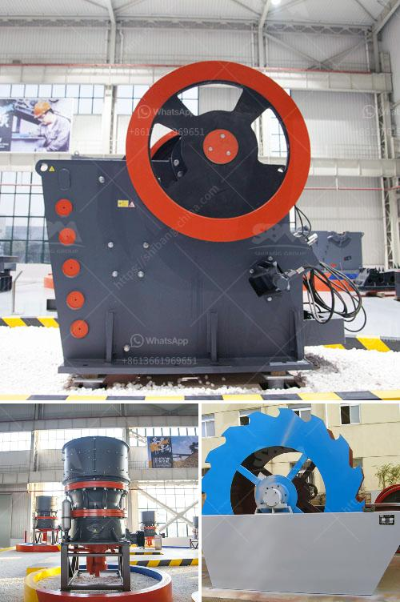

<h3>project cost to manufacture 200 tpd cement in in nepal</h3>
The cement industry in Nepal has witnessed significant growth in recent years due to the rise in infrastructural projects. The manufacturing of cement requires a detailed and comprehensive understanding of the project cost. This article aims to shed light on the costs associated with the production of 200 tons per day (TPD) of cement in Nepal.

The first and foremost consideration in setting up a cement manufacturing plant is the availability of suitable land. The cost of purchasing or leasing the land varies depending on the location and size of the plot required. Additionally, the infrastructure costs such as roads, electricity, water supply, and drainage systems must be factored into the project cost.

Cement production requires significant quantities of raw materials, primarily limestone, clay, and gypsum. The cost of acquiring these raw materials can vary depending on their availability, proximity to the plant, and transportation costs. Ensuring a sustainable and reliable supply chain is crucial in managing raw material costs.

The incorporation of an efficient production line is vital for manufacturing 200 TPD of cement. Machinery and equipment costs encompass various components, including crushers, mills, kilns, conveyors, and packing units. The cost of these machines may vary depending on their capacity, quality, and sources (local or imported). 

Operating a cement plant requires a skilled workforce, including engineers, technicians, operators, and laborers. Their salaries, benefits, and training expenses add to the project cost. Ensuring proper staff planning and recruitment can help optimize costs associated with labor.

Cement production is an energy-intensive process, requiring substantial quantities of electricity and fuel. Investing in energy-efficient equipment and utilizing alternative energy sources can help reduce the project's energy costs in the long run. Careful consideration must be given to factors such as fuel prices, availability, and efficiency of power supply.

Complying with regulatory requirements, obtaining necessary permits, and meeting environmental standards add to the project cost. Establishing appropriate waste management systems and adopting environmentally friendly practices are essential for sustainability while incurring additional costs initially.

Once the cement is manufactured, marketing and distribution costs arise. Promoting the product, establishing a strong distribution network, and investing in transportation are all crucial factors to consider in the overall project cost.

The project cost for manufacturing 200 TPD of cement in Nepal involves numerous factors that must be meticulously evaluated. From land and infrastructure costs to machinery and equipment expenses, labor and staffing, utilities, and regulatory compliance, each element significantly impacts the overall project cost. It is imperative for investors and industry players to formulate comprehensive business plans, conduct thorough market research, and assess financial viability in order to manage costs effectively and achieve success in Nepal's growing cement industry.
<h3>Contact us</h3><ul><li><strong>Whatsapp:&nbsp;<a href="https://wa.me/8613661969651">+8613661969651</a></strong></li><li><a href="https://swt.shibang-china.com/?git&amp;zhl&amp;project cost to manufacture 200 tpd cement in in nepal"><strong>Online Service(chat now)</strong></a></li></ul><h3>Related</h3><ul><li><a href='hydraulic cone crusher application.md'>hydraulic cone crusher application</a></li><li><a href='graphite ore buyers in india.md'>graphite ore buyers in india</a></li><li><a href='coal washing process machine.md'>coal washing process machine</a></li><li><a href='size to a jaw crusher and cone crusher.md'>size to a jaw crusher and cone crusher</a></li><li><a href='products scm ultrafine mill.md'>products scm ultrafine mill</a></li></ul>