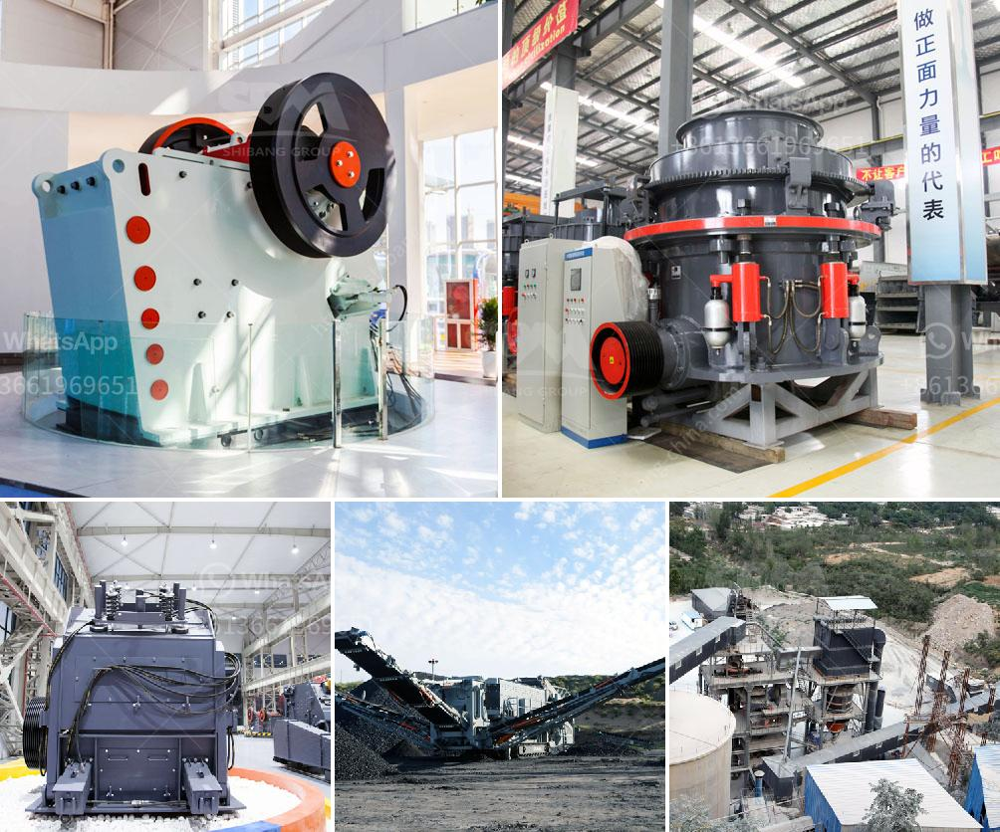

<h3>project report for stone crushing plant</h3>
Stone crushing plant, a complete stone crushing production line, consists of a vibrating feeder, a jaw crusher, an impact crusher or a cone crusher, a vibrating screen and belt conveyors. The crushed stone materials are conveyed to secondary stage crusher by belt conveyor for secondary crushing before they are sent to vibrating screen to be separated. After separating, qualified materials will be taken away as final products, as while unqualified materials will be carried back to the stone crushing equipment for recrushing.

Stone crushing plant can be divided into various stone production lines according to the different requirements of the customers. The stone crushing plant can process materials including limestone, granite, quartz stone, marble, dolomite, micalex, iron ore, copper ore, manganese, lead and zinc ores and many other materials.

In order to meet the different demands of customers, stone crushing plant can be equipped with various crushing equipment such as cone crusher, dust catcher in the crushing plant, vibrating feeder, vibrating screen, sand washing machine and belt conveyor. Depending on the specific demands, the cone crusher can be divided into PY series spring cone crusher, Symons cone crusher, HPC hydraulic cone crusher, and HCS series hydraulic cone crusher. Besides, the stone production line processes materials with different properties, such as hardness, size, and gradation. Therefore, different configurations will be needed.

The stone crushing plant is not only used in the primary crushing stage and secondary crushing stage, but also can be applied to the tertiary crushing stage for producing different types of aggregate. As we all know, different production requirements necessitate the proper selection of crushing equipment.

For the stone crushing plant, there are several characteristics that distinguish it from other crushing plants. Firstly, stone production line is flexible in configuration, which means that we can design the complete crushing plant according to the requirements of customers and adjust the size of the finished products. Secondly, stone production line has a high degree of automation, which saves manpower and improves efficiency. Lastly, stone production line adopts environmental protection design, which effectively reduces dust pollution and noise pollution.

To sum up, a stone crushing plant is a complete production line used to process stones and produce aggregate. It is the ideal equipment for crushing and screening operations in mining, metallurgy, construction, highways, railways, water conservancy and other industries.

In conclusion, a stone crushing plant with 300 to 500 tons per hour capacity is suitable for medium scale production line. While a stone crushing plant with larger or smaller capacity is appropriate for smaller scale production line. It is cost-effective. The reasons why stone crushing plants are popular in the market are as follows: it is flexible, efficient, economical, and environmentally friendly. If you need to invest in a stone crushing plant, please don't hesitate to contact us.
<h3>Contact us</h3><ul><li><strong>Whatsapp:&nbsp;<a href="https://wa.me/8613661969651">+8613661969651</a></strong></li><li><a href="https://swt.shibang-china.com/?git&amp;zhl&amp;project report for stone crushing plant"><strong>Online Service(chat now)</strong></a></li></ul><h3>Related</h3><ul><li><a href='stone quarry machines in uganda for sale.md'>stone quarry machines in uganda for sale</a></li><li><a href='stone crusher plant pakistan feasibility report.md'>stone crusher plant pakistan feasibility report</a></li><li><a href='waived diamond mesh equipment south africa.md'>waived diamond mesh equipment south africa</a></li><li><a href='stone crusher machine plant for sale in pakistan.md'>stone crusher machine plant for sale in pakistan</a></li><li><a href='mineral material crusher.md'>mineral material crusher</a></li></ul>