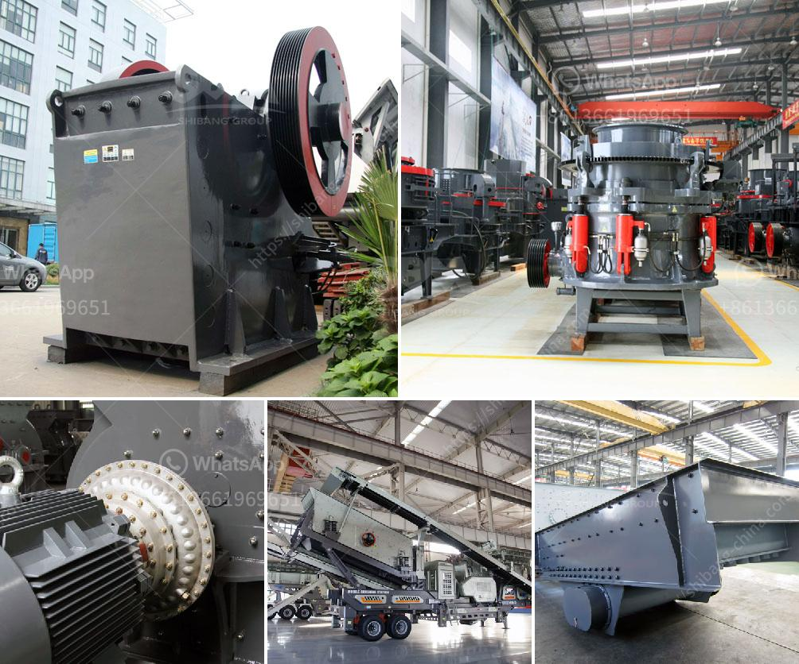

<h3>pulveriser manufacturer in shanghai</h3>
Shanghai, the bustling metropolis of China, is known for its vibrant economy and bustling industrial sector. One crucial component that fuels the growth of this sector is the presence of pulveriser manufacturers. These companies play a vital role in providing efficient and cost-effective equipment for various industries, including mining, construction, and pharmaceuticals.

A pulveriser is a mechanical device used to grind different materials into fine powders or particles. It is widely used in industries requiring size reduction, such as coal mining, cement production, and food processing. With its ability to crush, grind, and pulverize materials, a pulveriser significantly enhances manufacturing processes and increases productivity.

Shanghai, being a prominent hub of industrial activity, houses several pulveriser manufacturers. These companies are equipped with state-of-the-art machinery and technology to produce high-quality pulverisers that meet industry standards and cater to the diverse needs of their clients. Moreover, being located in Shanghai provides these manufacturers with easy access to a wide range of raw materials, skilled labor, and excellent transportation infrastructure, facilitating the efficient manufacturing and distribution of their products.

One notable pulveriser manufacturer in Shanghai is ABC Pulverisers. With more than a decade of experience, ABC Pulverisers has established itself as a reliable and leading provider of pulverising solutions in China. The company offers a comprehensive range of pulverisers, including impact pulverisers, hammers mills, and pin mills, catering to the varied needs of industries like mining, construction, and chemical processing.

Another renowned pulveriser manufacturer in Shanghai is XYZ Pulverisers. With its commitment to innovation and customer satisfaction, XYZ Pulverisers has gained a significant market share in the industry. The company specializes in manufacturing advanced pulverising machines that are not only efficient but also environmentally friendly. XYZ Pulverisers' products have been widely praised for their energy efficiency, durability, and low operating costs.

The presence of such reputable pulveriser manufacturers in Shanghai has had a profound impact on the industrial landscape of the city. These manufacturers have played a crucial role in boosting the productivity of several key industries, thereby contributing to the overall economic growth of Shanghai and the nation as a whole. The pulverisers produced by these companies have enabled businesses to achieve higher production rates, reduce wastage, and cut down on operational costs, thereby increasing their competitiveness in the market.

Furthermore, the availability of locally produced pulverisers has resulted in a decrease in dependency on imported equipment. This not only helps in saving foreign exchange but also promotes the growth of China's domestic manufacturing capabilities. The presence of these manufacturers has also led to the development of a robust support ecosystem of suppliers, technicians, and maintenance providers, ensuring a smooth operation and longevity of the pulverising equipment.

In conclusion, pulveriser manufacturers in Shanghai have played a significant role in fueling the growth of the industrial sector in the city. Their high-quality and efficient pulverisers have revolutionized various industries, enabling businesses to achieve higher productivity and cost savings. With Shanghai's favorable business environment, these manufacturers are expected to continue thriving and contributing to the economic prosperity of the city and the nation.
<h3>Contact us</h3><ul><li><strong>Whatsapp:&nbsp;<a href="https://wa.me/8613661969651">+8613661969651</a></strong></li><li><a href="https://swt.shibang-china.com/?git&amp;zhl&amp;pulveriser manufacturer in shanghai"><strong>Online Service(chat now)</strong></a></li></ul><h3>Related</h3><ul><li><a href='mobile cone crusher for sale.md'>mobile cone crusher for sale</a></li><li><a href='stone quarrying process.md'>stone quarrying process</a></li><li><a href='mobile crusher track.md'>mobile crusher track</a></li><li><a href='turkish supplier for phosphate ball mill.md'>turkish supplier for phosphate ball mill</a></li><li><a href='copper processing equipment.md'>copper processing equipment</a></li></ul>