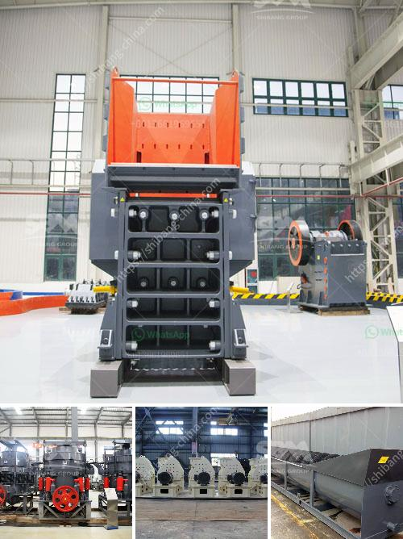

<h3>pulveriser quartzite china make</h3>
China has long been known for its impressive advancements in technology, with the pulveriser quartzite being a prime example. This innovative machine has revolutionized the processing of quartzite, a type of metamorphic rock known for its hardness and durability.

The pulveriser quartzite China make is specifically designed to crush and grind quartzite into fine powder, making it suitable for various industrial applications. It utilizes powerful blades that rotate at high speeds to break down the rock, resulting in a uniform and consistent texture. The machine is equipped with cutting-edge technology that enhances its efficiency and performance, allowing for a faster and more precise processing of quartzite.

One of the key benefits of the pulveriser quartzite China make is its versatility. It can process a wide range of quartzite materials, including those with varying degrees of hardness. This makes it an essential tool for industries such as construction, mining, and manufacturing, where quartzite is widely used for its strength and aesthetic appeal.

Additionally, the pulveriser quartzite China make offers several advantages over traditional methods of quartzite processing. It significantly reduces manual labor by automating the crushing and grinding process, saving both time and money for businesses. Moreover, the machine minimizes wastage by ensuring that every piece of quartzite is finely ground, maximizing the yield and value of the material.

Furthermore, the pulveriser quartzite China make is designed with durability and reliability in mind. It is built using high-quality materials and undergoes rigorous testing to ensure its robustness and longevity. This extends the lifespan of the machine, allowing businesses to maximize their investment and minimize maintenance costs.

In conclusion, the pulveriser quartzite China make is a game-changer in the field of material processing. Its ability to efficiently crush and grind quartzite into fine powder has undoubtedly transformed various industries. With its versatility, efficiency, and durability, this machine offers a cost-effective solution for businesses looking to enhance their quartzite processing capabilities. As China continues to lead the way in technological advancements, the pulveriser quartzite China make stands as a testament to the country's commitment to innovation.
<h3>Contact us</h3><ul><li><strong>Whatsapp:&nbsp;<a href="https://wa.me/8613661969651">+8613661969651</a></strong></li><li><a href="https://swt.shibang-china.com/?git&amp;zhl&amp;pulveriser quartzite china make"><strong>Online Service(chat now)</strong></a></li></ul><h3>Related</h3><ul><li><a href='top ten manufacturers of stone crusher in the world.md'>top ten manufacturers of stone crusher in the world</a></li><li><a href='stone crusher supplier in orissa.md'>stone crusher supplier in orissa</a></li><li><a href='mining equipment for sale in japan.md'>mining equipment for sale in japan</a></li><li><a href='copper ore processing plants in pakistan.md'>copper ore processing plants in pakistan</a></li><li><a href='concrete and stone crushing machines in kenya.md'>concrete and stone crushing machines in kenya</a></li></ul>