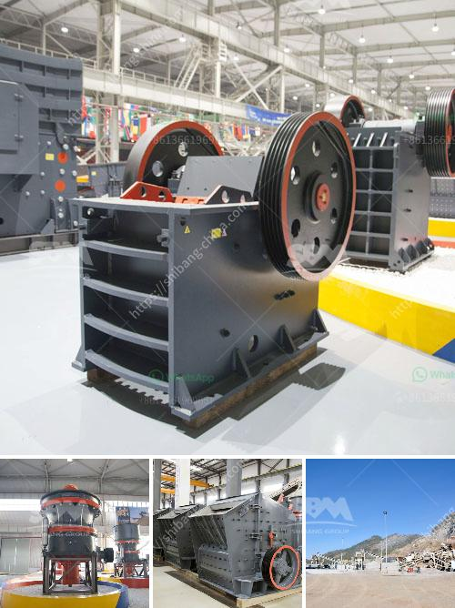

<h3>pulverized ball mill in malaysia</h3>
The pulverized ball mill technique, also known as ball milling, is a common method of producing powdered materials in Malaysia. With the ability to grind a wide variety of materials, this versatile process is becoming increasingly popular in the country.

The process involves placing a powdered material into a hollow cylindrical container, which is then rotated along its longitudinal axis. This rotation causes the material to be ground into a fine powder by the friction and impact of the grinding media, usually in the form of steel balls. The size of the grinding media, as well as the speed of rotation, can be adjusted to produce the desired fineness of the final product.

One of the key advantages of using a pulverized ball mill is its ability to produce very fine powders. This is particularly useful for industries such as pharmaceuticals, where precise particle size distribution is crucial for the effectiveness of the product. By controlling the size of the grinding media and the speed of rotation, manufacturers can achieve particle sizes ranging from a few micrometers to sub-micron levels.

In addition to its fine grinding capabilities, the pulverized ball mill offers other advantages as well. For example, it is a relatively simple and cost-effective process, requiring only minimal equipment and energy consumption. This makes it an attractive option for small-scale manufacturers and those with limited resources. Furthermore, the process can be easily scaled up to meet higher production demands, making it suitable for large-scale industrial applications.

The pulverized ball mill technique is widely used in various industries in Malaysia. In the cement industry, for instance, it is used to grind raw materials such as limestone and clinker to produce cement powder. In the food industry, it is employed to grind spices and other ingredients to enhance their flavors and textures. Similarly, in the chemical industry, it is utilized to grind chemicals and other substances for various applications.

In conclusion, the pulverized ball mill technique is a versatile and efficient method for producing powdered materials in Malaysia. Its ability to produce fine powders and its ease of use make it a popular choice for many industries. Furthermore, its cost-effectiveness and scalability make it suitable for both small-scale manufacturers and large-scale industrial applications. As Malaysia continues to develop its industrial sector, the pulverized ball mill is expected to play a crucial role in the country's manufacturing processes.
<h3>Contact us</h3><ul><li><strong>Whatsapp:&nbsp;<a href="https://wa.me/8613661969651">+8613661969651</a></strong></li><li><a href="https://swt.shibang-china.com/?git&amp;zhl&amp;pulverized ball mill in malaysia"><strong>Online Service(chat now)</strong></a></li></ul><h3>Related</h3><ul><li><a href='advantages of jaw crushers.md'>advantages of jaw crushers</a></li><li><a href='cost of small mica processing plant in giridih india.md'>cost of small mica processing plant in giridih india</a></li><li><a href='quarry crusher equipment made in turkey.md'>quarry crusher equipment made in turkey</a></li><li><a href='30 x 42 portable jaw crusher for sale.md'>30 x 42 portable jaw crusher for sale</a></li><li><a href='industrial limestone impact crushers.md'>industrial limestone impact crushers</a></li></ul>