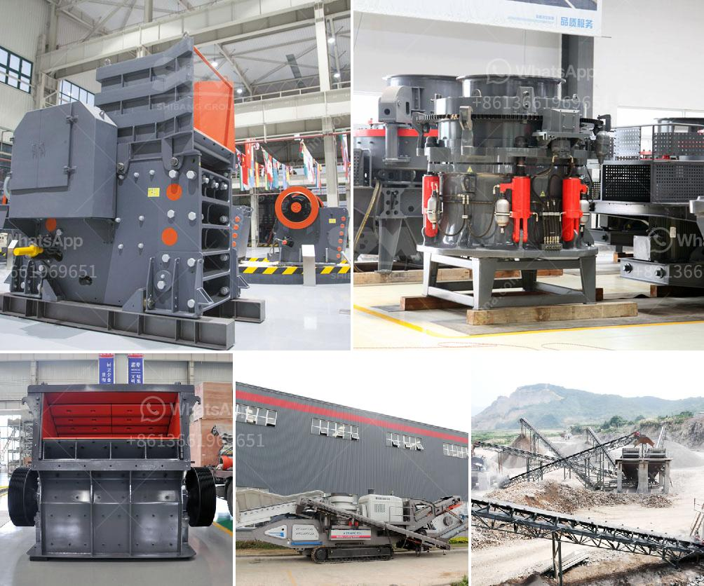

<h3>pulverizing ball mills suppliers</h3>
In the world of mineral processing, the grinding of ore is an essential process. Pulverizing materials into a fine powder is vital for achieving the desired chemical and physical properties, enabling easy separation and concentration of valuable minerals. One of the most commonly used methods for this purpose is the ball mill.

Ball mills are widely utilized in the mining industry due to their low installation cost and high efficiency. Without any doubt, they are the preferred equipment for pulverizing materials, especially when it comes to grinding ores. These machines consist of a rotating cylindrical drum filled with steel balls, creating an impactful cascade motion that crushes the ore into a fine powder.

As with any equipment, the quality and reliability of ball mills are crucial to ensuring efficient grinding operations. Therefore, relying on reputable and experienced pulverizing ball mills suppliers becomes imperative for mining companies. These suppliers, equipped with advanced manufacturing capabilities and engineering expertise, offer reliable solutions to meet the demanding needs of the industry.

One of the key aspects to consider when selecting suppliers is their ability to customize ball mills based on specific requirements. Mining companies often have particular demands regarding the capacity, size, and power of the mills. Reputable suppliers have the expertise to design and manufacture ball mills that precisely meet these specifications, ensuring optimal performance and productivity.

Suppliers that formulate and implement strict quality control measures also play a significant role in the selection process. They utilize advanced technologies and carry out comprehensive tests to guarantee that the manufactured ball mills conform to the highest standards. This attention to detail ensures that the mills operate smoothly, reducing downtime and maintenance costs for mining operations.

Furthermore, it is essential to choose suppliers with an excellent track record of delivering and installing ball mills efficiently. Given the nature of mining projects, time is of the essence. Reliable suppliers understand this and have robust supply chains in place to ensure timely and hassle-free deliveries. Moreover, they provide expert assistance during installation, commissioning, and training, which further strengthens the long-term partnership between suppliers and mining companies.

Moreover, reliable suppliers continuously prioritize research and development, striving to enhance the efficiency and performance of ball mills. They invest in state-of-the-art technologies and techniques to optimize the design and functionalities of their equipment. By staying up-to-date with the latest advancements in the field, suppliers can provide cutting-edge solutions that align with the evolving needs of the industry.

To sum up, the role of pulverizing ball mills suppliers is indispensable in the mining industry. These suppliers contribute to the success of mining operations by offering customized, reliable, and efficient equipment. They possess the knowledge, expertise, and commitment to ensure that their ball mills deliver optimal performance and longevity, thereby supporting the overall sustainability and profitability of the mining sector. Thus, selecting reliable and reputable suppliers is a crucial step towards achieving efficient grinding operations in mineral processing.
<h3>Contact us</h3><ul><li><strong>Whatsapp:&nbsp;<a href="https://wa.me/8613661969651">+8613661969651</a></strong></li><li><a href="https://swt.shibang-china.com/?git&amp;zhl&amp;pulverizing ball mills suppliers"><strong>Online Service(chat now)</strong></a></li></ul><h3>Related</h3><ul><li><a href='crushing milling machine for graphite powder.md'>crushing milling machine for graphite powder</a></li><li><a href='german crusher for sale.md'>german crusher for sale</a></li><li><a href='gypsum chromium limestone mining.md'>gypsum chromium limestone mining</a></li><li><a href='bentonite plant dimensions.md'>bentonite plant dimensions</a></li><li><a href='crusher for pozzuolana.md'>crusher for pozzuolana</a></li></ul>