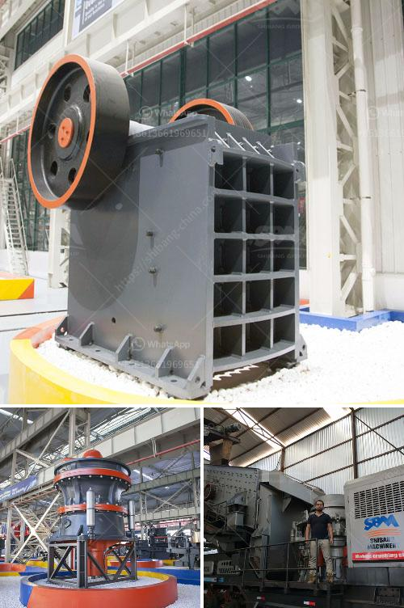

<h3>purification process of iron ore</h3>
The extraction of iron ore is a process that has widespread significance in the industrial revolution. The iron ore is commonly known as haematite, and the hematite undergoes a purification process before it is shipped off to become steel. Manufacturing process of iron ore involves following steps:

Iron ore is usually obtained in the form of hematite (Fe2O3) or magnetite (Fe3O4) and is typically found in rocks known as banded iron formations. These rocks are located all over the world and are estimated to contain 71.5 billion tons of iron ore reserves.

Pit mining is the most common method for extracting iron ore. It involves large-scale machinery like trucks and heavy machinery to extract the ore from the earth's surface. The extracted ore is then transported to the processing plant.

At the processing plant, the ore is crushed into small particles and ground to a fine powder. This process is known as crushing and grinding. The ground ore is then separated into different grades using a series of screens and hydrocyclones. The fine particles are called fines and the larger particles are called lump ore.

Next, the crushed and ground ore undergoes a process called gravity separation. This involves using water to wash away impurities and separate the iron ore from the rock particles.

As the ore is heavier than the rock, it settles to the bottom of a wash box with a series of riffles. The iron ore is separated from the taconite using magnetism. The remaining rock is waste material and is dumped into tailings basins. The taconite powder with the iron in it is called concentrate.

After the initial separation of the iron ore from the rock particles, the taconite ore is further purified by using electromagnetic separators. Electromagnets attract and remove magnetic pieces of iron, such as magnetite. The electromagnetic separators separate the iron ore from non-iron particles.

Flotation is the final major stage of ore beneficiation for the iron ore. After removing the magnetite, underground ore is introduced to a flotation cell, where it is mixed with water and other reagents. Iron ore undergoes flotation as a means of separating impurities from the concentrate.

The concentrate, which is now approximately 30% iron ore, is then pumped into magnetic separators to extract the

magnetite. The magnetite undergoes another round of magnetic separation to further concentrate the iron content.

Iron ore pellets are produced from the concentrate by adding a binder to the mixture and rolling the mixture into balls. Pellets are then dried and hardened to form the final iron ore pellets. This is usually done with the use of a kiln.

The purification process of iron ore is a complex process involving several stages. From extraction to the final product, iron ore goes through different purification steps to remove impurities and increase its concentration. This makes it suitable for a variety of applications, especially in the steel industry. The purification process ensures that high-quality iron ore is produced, enhancing the efficiency and sustainability of the steel manufacturing process.
<h3>Contact us</h3><ul><li><strong>Whatsapp:&nbsp;<a href="https://wa.me/8613661969651">+8613661969651</a></strong></li><li><a href="https://swt.shibang-china.com/?git&amp;zhl&amp;purification process of iron ore"><strong>Online Service(chat now)</strong></a></li></ul><h3>Related</h3><ul><li><a href='calculating capacity of a roll crusher.md'>calculating capacity of a roll crusher</a></li><li><a href='stone crusher with tractor.md'>stone crusher with tractor</a></li><li><a href='roller mill for sale kenya.md'>roller mill for sale kenya</a></li><li><a href='concrete crushing machine cost.md'>concrete crushing machine cost</a></li><li><a href='malaysia sand washer supplier.md'>malaysia sand washer supplier</a></li></ul>