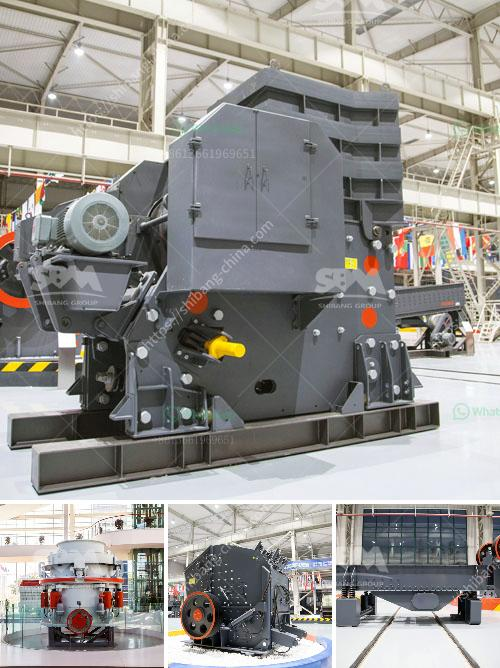

<h3>puzolana 250 tph crusher</h3>
Puzolana 250 tph crusher is a highly efficient and powerful crushing machine, designed to break down various types of stones such as granite, basalt, limestone, sandstone and other materials. These crushers are robust and reliable, providing high productivity and low operating costs.

The crusher features a unique combination of crusher cavity design, crushing forces, reliability and safety. Its advanced hydraulic system allows for automatic opening of the crusher setting, ensuring high performance and easy maintenance. The crusher is equipped with a large feed opening and a steep cavity, ensuring a high reduction ratio and excellent shape of the end product.

One of the key advantages of the Puzolana crusher is its versatility. It can be used in a range of applications, including quarrying, surface mining, construction waste recycling, and concrete recycling. The crusher is capable of handling large volumes of material and can produce high-quality aggregates for various construction projects.

With a capacity of 250 tph, this crusher is suitable for crushing both soft and hard rocks. It can handle a wide range of feed sizes, from a maximum of 600 mm to a minimum of 100 mm. The crusher is equipped with a powerful motor and advanced control system, ensuring optimal performance and efficient operation.

In conclusion, the Puzolana 250 tph crusher is a highly efficient and reliable crushing machine, designed to meet the demanding requirements of various construction projects. Its robust construction, high productivity, and low operating costs make it an ideal choice for any crushing application. Whether it is quarrying, mining or recycling, this crusher is capable of delivering superior performance and excellent end product quality.
<h3>Contact us</h3><ul><li><strong>Whatsapp:&nbsp;<a href="https://wa.me/8613661969651">+8613661969651</a></strong></li><li><a href="https://swt.shibang-china.com/?git&amp;zhl&amp;puzolana 250 tph crusher"><strong>Online Service(chat now)</strong></a></li></ul><h3>Related</h3><ul><li><a href='ballast making machine kenya.md'>ballast making machine kenya</a></li><li><a href='iron ore beneficiation plant suppliers.md'>iron ore beneficiation plant suppliers</a></li><li><a href='used crusher for sale in fujairah.md'>used crusher for sale in fujairah</a></li><li><a href='quartz powder mining mill.md'>quartz powder mining mill</a></li><li><a href='mobile stone crushing machine in america.md'>mobile stone crushing machine in america</a></li></ul>