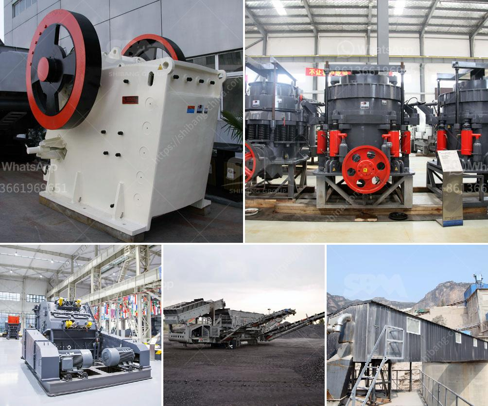

<h3>puzzolana 200 tph stage aggregate crushing</h3>
Puzzolana 200 tph stage aggregate crushing is a medium-sized, advanced technology aggregate crushing plant with capacity 200 tph. The unique feature of this plant is that it is designed and built to process the hardest rocks and ores. The cone crusher is the best choice when it comes to large feed sizes and high crushing ratios at the secondary and tertiary stages. With its high reduction ratio and high crushing capacity, puzzolana 200 tph stage aggregate crushing ensures excellent product shape and quality.

The puzzolana 200 tph stage aggregate crushing plant consists of jaw crusher, cone crusher, vibrating screen and belt conveyors. The plant crushes the large rocks into smaller particles with varying sizes for various construction needs. The primary jaw crusher reduces the oversized rocks to smaller sizes for further processing.

After the primary crushing stage, the crushed materials are then sent to the secondary cone crusher for further reduction. The cone crusher is designed to produce high-quality aggregate and produce a consistent product shape. It has a large crushing ratio and high crushing capacity, making it ideal for the secondary crushing process.

The vibrating screen separates the crushed materials into different sizes for further processing. This ensures that the desired aggregate sizes are obtained, and any oversize materials are sent back to the cone crusher for re-crushing. The vibrating screen also ensures that the final product is of the highest quality and meets the required specifications.

The belt conveyors transport the crushed materials from one stage to another. They are designed to handle heavy loads and ensure smooth and efficient material transfer. The belt conveyors are an integral part of the aggregate crushing plant and play a crucial role in the overall operation.

With its advanced technology and high crushing capacity, puzzolana 200 tph stage aggregate crushing plant is widely used in various construction applications. It is suitable for crushing a variety of hard and abrasive rocks, such as granite, basalt, and limestone. The plant is capable of producing high-quality aggregates for use in roads, buildings, and other construction projects.

In conclusion, puzzolana 200 tph stage aggregate crushing plant is an advanced technology aggregate crushing plant with high crushing capacity and excellent product shape. It is ideal for secondary and tertiary crushing stages, and can produce a consistent product size. With its advanced technology and reliable performance, it is widely used in various construction applications. Whether for road construction, building construction, or any other construction needs, this plant ensures high-quality aggregates that meet the required specifications.
<h3>Contact us</h3><ul><li><strong>Whatsapp:&nbsp;<a href="https://wa.me/8613661969651">+8613661969651</a></strong></li><li><a href="https://swt.shibang-china.com/?git&amp;zhl&amp;puzzolana 200 tph stage aggregate crushing"><strong>Online Service(chat now)</strong></a></li></ul><h3>Related</h3><ul><li><a href='basalt fiber production lines.md'>basalt fiber production lines</a></li><li><a href='quarry ccrusher equipment price.md'>quarry ccrusher equipment price</a></li><li><a href='cement plant cost estimation cement plant cost.md'>cement plant cost estimation cement plant cost</a></li><li><a href='pioneer ve rock crusher.md'>pioneer ve rock crusher</a></li><li><a href='sand dust removal.md'>sand dust removal</a></li></ul>