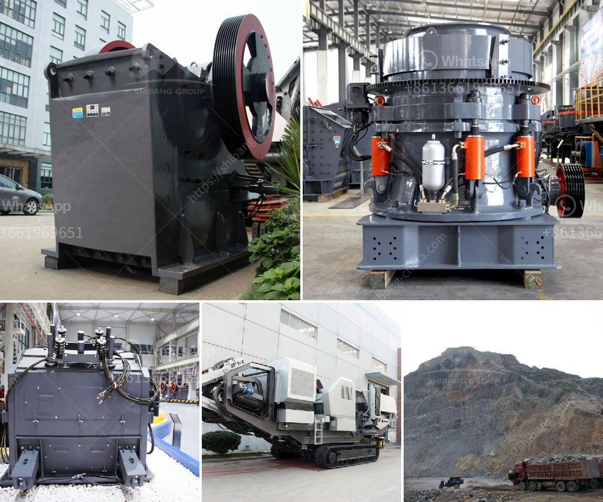

<h3>quarries rock crushing process</h3>
Quarries are necessary for infrastructure development as they provide vital materials for construction. One key aspect of quarry operations is the rock crushing process. This process involves the systematic reduction of the size of rocks and stones to extract valuable materials such as limestone, granite, or gravel.

The first step in the rock crushing process is the primary crushing stage. Here, large rocks are crushed into smaller pieces using heavy-duty machinery. Jaw crushers are commonly used for this stage, as they can handle large rocks of up to 3 feet in diameter. The rocks are fed into the crusher, where they are compressed between a fixed jaw plate and a movable jaw plate. The compressive force applied to the rocks breaks them into smaller, more manageable sizes.

After primary crushing, the crushed rocks are then classified into different sizes through screens or classifiers. This step ensures that the materials meet the specific requirements of various construction projects. The classified rocks are then stored in stockpiles for further processing.

Next, the secondary crushing stage takes place. In this stage, the already crushed rocks are further reduced in size using machinery such as cone crushers or impact crushers. These crushers operate by applying high-pressure compression or impact forces to the rocks. The secondary crushing process results in smaller, more uniform-sized rocks suitable for specific construction applications.

Finally, the crushed rocks are transported to their designated destinations. Some may be used as raw materials for road construction, while others are processed into concrete aggregates for building foundations. The rock crushing process is carefully regulated to meet quality standards, ensuring that the end products are suitable for their intended uses.

In conclusion, the rock crushing process in quarries plays a crucial role in providing the necessary materials for construction projects. It involves primary and secondary crushing stages, which reduce the size of rocks to meet specific requirements. By carefully regulating this process, quarries can produce high-quality materials necessary for infrastructure development.
<h3>Contact us</h3><ul><li><strong>Whatsapp:&nbsp;<a href="https://wa.me/8613661969651">+8613661969651</a></strong></li><li><a href="https://swt.shibang-china.com/?git&amp;zhl&amp;quarries rock crushing process"><strong>Online Service(chat now)</strong></a></li></ul><h3>Related</h3><ul><li><a href='used stone crusher for sale germany.md'>used stone crusher for sale germany</a></li><li><a href='concrete crushing plant business plan.md'>concrete crushing plant business plan</a></li><li><a href='mobile crusher hire in uae.md'>mobile crusher hire in uae</a></li><li><a href='limestone grinding system.md'>limestone grinding system</a></li><li><a href='vibrating classifiing screen.md'>vibrating classifiing screen</a></li></ul>