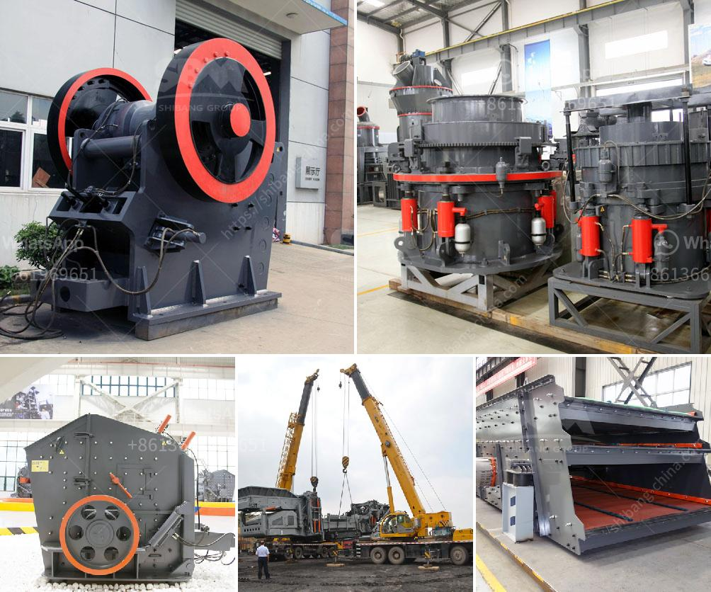

<h3>quarry ccrusher equipment price</h3>
Quarrying operations involve a variety of materials extraction processes that often require a substantial amount of crushing equipment. Crushers are used to break rocks into smaller sizes, reducing them to the desired size for further processing. However, different processes require different types of crushing equipment. Hence, it is crucial to choose the right crusher for your quarry operation.

One of the key factors that determine the selection of a crusher is the end product specification. However, the crusher's price also plays a significant role in the decision-making process. Let's dive deeper into quarry crusher equipment prices and explore various factors that influence the pricing.

First and foremost, the type and capacity of the crusher greatly impact its price. There are several types of crushers commonly used in quarries, including jaw crushers, impact crushers, cone crushers, and gyratory crushers. These crushers differ in their crushing principle, capacity, and size reduction ratio, thereby affecting their price range.

Jaw crushers are known for their durability and less maintenance requirements. They are ideal for primary crushing applications in quarry operations. However, they may have a higher initial cost compared to other crushers. On the other hand, cone crushers and impact crushers are more suitable for secondary and tertiary crushing stages, offering high production capacity. However, their prices can also vary significantly based on their features and capabilities.

Another crucial factor affecting crusher prices is the brand and reputation of the manufacturer. Well-established brands often offer higher-quality equipment that commands a premium price. While these brands can be more expensive, they generally come with better support, reliability, and after-sales service. On the other hand, smaller or less-known brands may offer competitive prices but could lack the same level of reputation and support.

The sourcing and availability of parts and components also impact the pricing of crushers. If a particular crusher model requires rare or hard-to-find components, it may result in higher prices. Additionally, the location of the manufacturer can also influence the equipment price. Equipment manufactured in countries with lower labor and production costs may be more affordable.

Apart from the initial purchase price, it is important to consider the long-term operating costs associated with a crusher. Factors such as energy consumption, maintenance, and spare parts availability contribute to ongoing expenses. It is advisable to choose a crusher that achieves a balance between initial price and long-term operational costs to ensure maximum return on investment.

Lastly, demand and market conditions also play a role in determining crusher equipment prices. Fluctuations in the global market, changes in regulations, and advancements in technology can all affect the pricing dynamics. It is crucial to stay updated with industry trends and seek advice from experts to make informed decisions about crusher purchases.

Quarry crusher equipment prices can vary significantly based on multiple factors, including the crusher type, capacity, manufacturer reputation, availability of parts, and market conditions. By considering these factors and evaluating the specific requirements of your quarry operation, you can make an informed decision about the appropriate crusher that offers the best value for your investment. Remember, choosing the right equipment can improve productivity, reduce downtime, and ultimately lead to profitability.
<h3>Contact us</h3><ul><li><strong>Whatsapp:&nbsp;<a href="https://wa.me/8613661969651">+8613661969651</a></strong></li><li><a href="https://swt.shibang-china.com/?git&amp;zhl&amp;quarry ccrusher equipment price"><strong>Online Service(chat now)</strong></a></li></ul><h3>Related</h3><ul><li><a href='coal washing processing plant india manufacturer.md'>coal washing processing plant india manufacturer</a></li><li><a href='calcium carbide plant and machinery.md'>calcium carbide plant and machinery</a></li><li><a href='vibrating screen analysis.md'>vibrating screen analysis</a></li><li><a href='small gold ore crusher grinder.md'>small gold ore crusher grinder</a></li><li><a href='malaysia ball mill.md'>malaysia ball mill</a></li></ul>