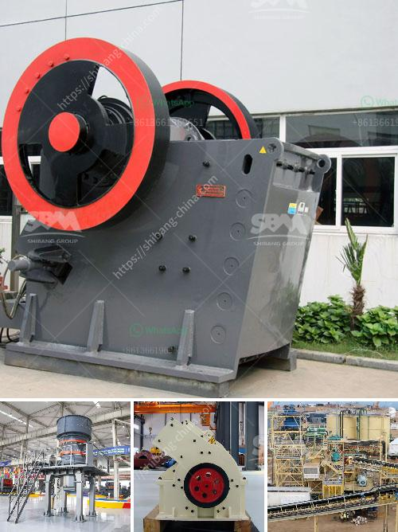

<h3>quarry crusher equipment made in turkey</h3>
Turkey has become one of the leading manufacturers of crushers and crushing equipment worldwide. To gain an insight into the quarry crusher equipment, we need to take a closer look at Turkey itself. Turkey is a modern, industrialized country with a diverse economy. The country has been experiencing significant growth and development in various sectors, including mining and manufacturing.

With such a promising business environment, it is no wonder that Turkey has become a major player in the production of quarry crusher equipment. Turkish manufacturers have been able to capitalize on the country's abundant natural resources and skilled labor force to produce high-quality crushers that can cater to the needs of different industries.

Quarry crusher equipment made in Turkey offers numerous advantages for businesses. Firstly, the Turkish manufacturers provide a wide range of advanced crushers, including jaw crushers, impact crushers, and cone crushers. With cutting-edge technology and high-quality materials, these crushers offer excellent performance, durability, and efficiency.

Additionally, quarry crusher equipment made in Turkey is highly cost-effective. Due to lower labor costs and raw material prices in Turkey compared to other countries, Turkish manufacturers are able to offer competitive prices without compromising on quality. This makes their equipment more appealing to businesses looking to invest in reliable and affordable crushers.

Furthermore, Turkey's strategic location serves as a gateway for exporting quarry crusher equipment to various regions across the world. The country's proximity to Europe, the Middle East, and North Africa enables manufacturers to reach international markets easily, increasing their export potential.

In conclusion, quarry crusher equipment made in Turkey is gaining popularity around the globe due to its exceptional quality and affordability. Thanks to the country's favorable business environment, Turkish manufacturers are able to produce crushers that meet the highest standards of performance and reliability. With their extensive range of products and competitive pricing, Turkish manufacturers are becoming the go-to choice for companies looking to invest in top-notch quarry crusher equipment.
<h3>Contact us</h3><ul><li><strong>Whatsapp:&nbsp;<a href="https://wa.me/8613661969651">+8613661969651</a></strong></li><li><a href="https://swt.shibang-china.com/?git&amp;zhl&amp;quarry crusher equipment made in turkey"><strong>Online Service(chat now)</strong></a></li></ul><h3>Related</h3><ul><li><a href='mobile stone crusher for concrete.md'>mobile stone crusher for concrete</a></li><li><a href='price list stone crusher german.md'>price list stone crusher german</a></li><li><a href='mobile gold refinery for sale.md'>mobile gold refinery for sale</a></li><li><a href='gold washing machine.md'>gold washing machine</a></li><li><a href='limestone coal grinding machinery manufacture in india.md'>limestone coal grinding machinery manufacture in india</a></li></ul>