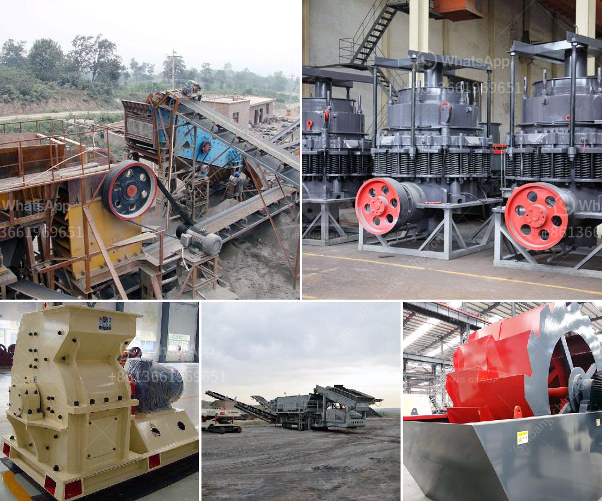

<h3>quarry crusher equipment suppliers miami</h3>
A quarry is a significant source of materials needed for various industries such as construction, road infrastructure, landscaping, and more. With the rapid development of these sectors, the demand for quarry crusher equipment suppliers in Miami is constantly growing. A reliable supplier plays a crucial role in ensuring the steady supply of high-quality materials that meet industry standards and customer requirements. In this article, we will explore the benefits of purchasing quarry crusher equipment from trustworthy suppliers in Miami.

One of the primary advantages of relying on reputable suppliers is the assurance of superior quality equipment. Established suppliers understand the importance of providing high-performing machinery that delivers efficient and reliable results. They carefully select and source the best-in-class equipment from well-known manufacturers who prioritize quality and durability. Consequently, by purchasing from such suppliers, customers can be confident that the quarry crusher equipment will be able to withstand heavy-duty operations and withstand wear and tear over an extended period.

Additionally, trustworthy suppliers in Miami offer a comprehensive range of quarry crusher equipment that caters to diverse customer needs. This includes not only primary crushers but also secondary and tertiary crushers, screens, feeders, and conveyors. Such a diverse product portfolio enables customers to find all the necessary equipment in one place, simplifying the procurement process and saving valuable time and effort.

Moreover, reliable suppliers often employ experienced and knowledgeable professionals who can provide expert advice and guidance to customers. They understand the unique requirements and challenges associated with different industries and are capable of recommending the most suitable equipment for specific applications. Their expertise can prove invaluable in optimizing productivity, reducing downtime, and ultimately maximizing the return on investment for customers.

Another distinctive advantage of purchasing quarry crusher equipment from reputable suppliers is access to excellent after-sales services. Suppliers who prioritize customer satisfaction recognize that providing ongoing support and maintenance services is vital. They have well-equipped service centers and a team of trained technicians who can address any concerns, conduct routine inspections, and perform repairs or replacements when needed. Consequently, customers can rely on prompt assistance and minimal equipment downtime, ensuring uninterrupted production and minimizing associated costs.

Furthermore, established suppliers often maintain a comprehensive inventory of spare parts for the equipment they offer. This allows them to quickly respond to customer requests and provide timely replacements, reducing production delays and minimizing the impact on operations. Having access to readily available spare parts ultimately enhances the equipment's longevity and performance, ensuring a seamless and efficient production process.

In conclusion, choosing reliable quarry crusher equipment suppliers in Miami is crucial for any construction or infrastructure project. The benefits of purchasing from trustworthy suppliers are numerous. Customers can rely on the superior quality of equipment, access a diverse range of quarry crusher machinery, receive expert advice, and benefit from excellent after-sales services and readily available spare parts. By partnering with the right supplier, businesses can ensure the smooth operation of their quarry, enhance productivity, and achieve their project goals efficiently.
<h3>Contact us</h3><ul><li><strong>Whatsapp:&nbsp;<a href="https://wa.me/8613661969651">+8613661969651</a></strong></li><li><a href="https://swt.shibang-china.com/?git&amp;zhl&amp;quarry crusher equipment suppliers miami"><strong>Online Service(chat now)</strong></a></li></ul><h3>Related</h3><ul><li><a href='project report for stone crushing plant.md'>project report for stone crushing plant</a></li><li><a href='vibrating screen analysis.md'>vibrating screen analysis</a></li><li><a href='crusher stone manufacturers.md'>crusher stone manufacturers</a></li><li><a href='grinding machine types use in cement industry.md'>grinding machine types use in cement industry</a></li><li><a href='stone quarry machines in uganda for sale.md'>stone quarry machines in uganda for sale</a></li></ul>