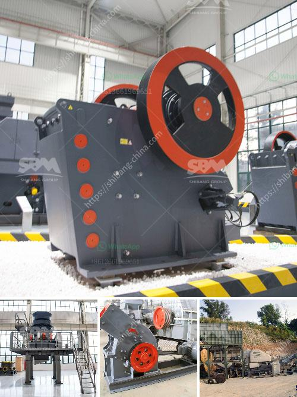

<h3>quarry crusher in nigeria</h3>
Quarrying is a process of extracting materials from the earth's surface, typically rock or limestone, which is utilized for various purposes. Quarry crusher is one of the key areas of quarry mining, where crusher roller is used for further crushing and breaking down rocks and limestone. This is a crucial part of the quarry mining operation as the crusher roller crushes the large rocks into smaller pieces suitable for further processing.

Nigeria, known for its vast mineral resources and burgeoning construction industry, possesses the ideal environment for quarrying. The quarry crusher in Nigeria has affiliations with various other businesses as well, supplying high-quality raw materials for construction purposes. This plays an instrumental role in the economic growth and development of Nigeria, as the demand for construction materials continues to rise.

One of the primary benefits of quarry crusher in Nigeria is its ability to increase job opportunities for the local population, as several quarrying activities require manpower. This helps in reducing unemployment rates and alleviating poverty, making it a vital industry for the Nigerian economy.

Moreover, quarrying and crushing rocks contribute to the development of infrastructure, including roads, bridges, and buildings, which are crucial for any country's progress. The stones and aggregates produced by the quarry crusher are used for multiple purposes, such as construction, road maintenance, and landscaping. This not only generates revenue but also provides a safer and more efficient means of transportation for the public.

It is important to note, however, that quarry crusher activities should be conducted responsibly, adhering to strict environmental protocols and regulations. This ensures the preservation of natural resources, protects nearby water bodies, and minimizes noise and dust pollution.

In conclusion, the quarry crusher in Nigeria plays a significant role in the development of the economy. The extraction and crushing of rocks and limestone provide crucial construction materials for infrastructure development. Furthermore, it creates job opportunities, reduces unemployment rates, and boosts economic growth. However, it is essential to practice responsible quarrying to safeguard the environment and preserve natural resources.
<h3>Contact us</h3><ul><li><strong>Whatsapp:&nbsp;<a href="https://wa.me/8613661969651">+8613661969651</a></strong></li><li><a href="https://swt.shibang-china.com/?git&amp;zhl&amp;quarry crusher in nigeria"><strong>Online Service(chat now)</strong></a></li></ul><h3>Related</h3><ul><li><a href='dolomite rock crusher.md'>dolomite rock crusher</a></li><li><a href='cement unit cost for 150 tons.md'>cement unit cost for 150 tons</a></li><li><a href='differnce between raw mill and ball mill.md'>differnce between raw mill and ball mill</a></li><li><a href='cost of a conveyor belt systems for mining.md'>cost of a conveyor belt systems for mining</a></li><li><a href='new technology stone crusher in india.md'>new technology stone crusher in india</a></li></ul>