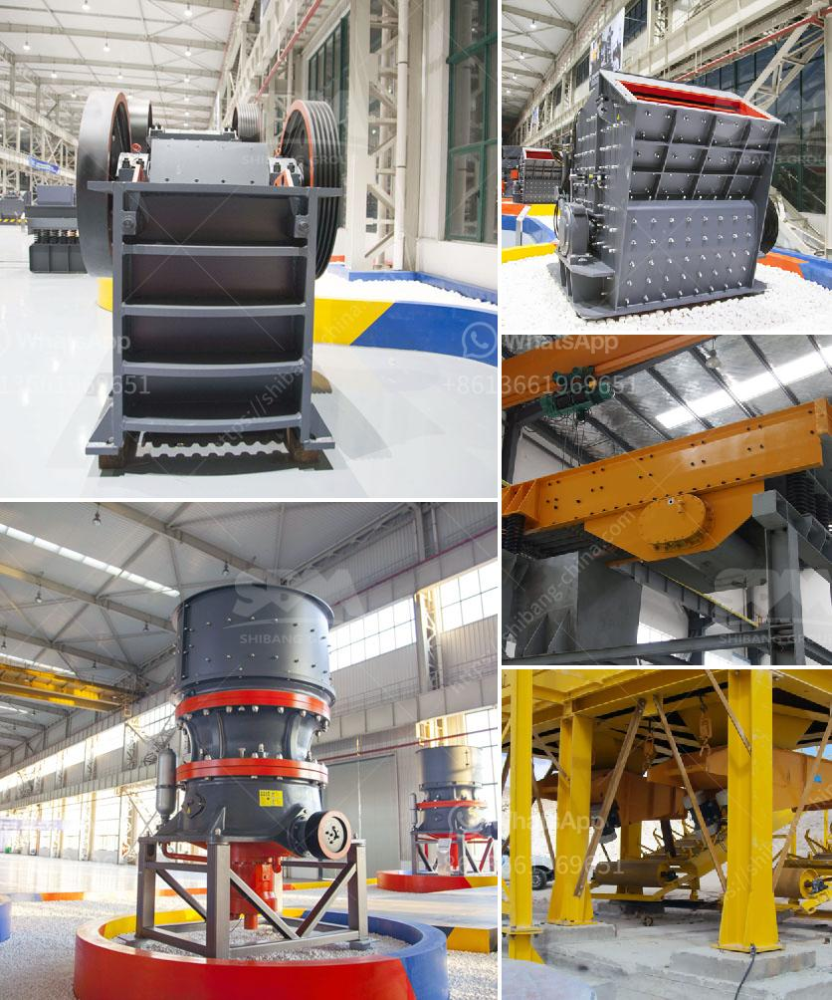

<h3>quarry crusher in zambia</h3>
Zambia is the mining capital of Africa, and it is rich in various mineral resources. However, the mining industry in Zambia faces immense challenges. One of the biggest challenges is the lack of adequate infrastructure. Quarrying is a vital activity in mining operations, and it requires an efficient and reliable crushing system to ensure a steady supply of raw materials. 

Quarry crushers play a pivotal role in the mining industry, where stone and rock materials are extracted for use in quarrying and construction projects. Quarrying involves both surface and underground mining techniques, which require various types of equipment such as crushers, screens, and conveyors. 

A quarry crusher is highly effective and has been widely used in many industries. Here are some key benefits of quarry crushers that have made them a preferred choice in Zambia:

1. Efficient Crushing Technology: Quarry crushers are high-productivity, versatile crushing machines designed to deliver high-quality end products efficiently. For example, the Lokotrack® LT1213™ mobile impact crushing plant, equipped with a Nordberg® NP1213™ impact crusher, can crush up to 500 tons of material per hour. Being robustly constructed, it withstands the harshest conditions and helps reduce downtime.

2. Versatility and Adaptability: Quarry crushers are available in various sizes and configurations to meet the diverse needs of different mining operations. For instance, a primary jaw crusher will be a heavy-duty machine capable of breaking large rocks into smaller aggregates. Conversely, a cone crusher is used for secondary or tertiary crushing to produce smaller-sized materials.

3. Environmental Friendliness: Many quarry crushers are designed with sustainability in mind. They incorporate technologies that reduce noise, dust, and emissions, thereby minimizing their impact on the environment. This makes them suitable for use in areas near residential or sensitive areas, as they maintain a low carbon footprint.

4. Cost-Effectiveness: Quarry crushers are cost-efficient and help mining companies maximize their profits. By processing materials on-site rather than transporting them to a central processing facility, companies save significantly on transportation costs. Additionally, efficient crushers minimize downtime, reducing operational costs and ensuring a constant supply of raw materials.

5. Safety Features: Quarry crushers are equipped with advanced safety features, protecting operators and workers from potential hazards. These include emergency stop buttons, safety interlocks, and remote control operation, which allow operators to operate the machines from a safe distance.

In conclusion, quarry crushers play a vital role in the mining industry in Zambia by efficiently crushing rocks and stones to produce a steady supply of raw materials. They offer numerous benefits, including efficient crushing technology, versatility, and adaptability, environmental friendliness, cost-effectiveness, and enhanced safety. Therefore, investing in a quarry crusher is a smart choice for mining companies in Zambia, as it helps them increase their productivity and profitability while minimizing their impact on the environment.
<h3>Contact us</h3><ul><li><strong>Whatsapp:&nbsp;<a href="https://wa.me/8613661969651">+8613661969651</a></strong></li><li><a href="https://swt.shibang-china.com/?git&amp;zhl&amp;quarry crusher in zambia"><strong>Online Service(chat now)</strong></a></li></ul><h3>Related</h3><ul><li><a href='gold mining equipment stores in tanzania.md'>gold mining equipment stores in tanzania</a></li><li><a href='mobile gold refinery for sale.md'>mobile gold refinery for sale</a></li><li><a href='price of a set of stone crushing machine.md'>price of a set of stone crushing machine</a></li><li><a href='how much is earned in the stone crusher.md'>how much is earned in the stone crusher</a></li><li><a href='find fine jaw crusher in china.md'>find fine jaw crusher in china</a></li></ul>