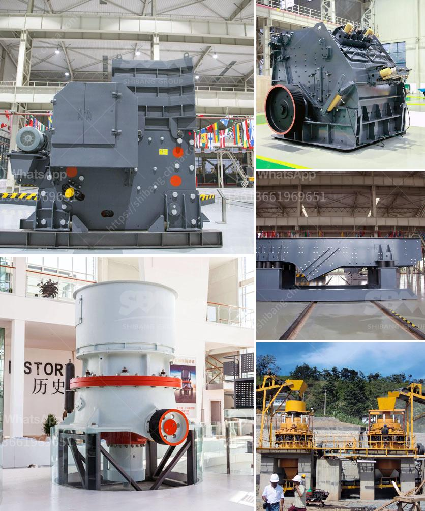

<h3>quarry crusher machines for sale</h3>
Quarries are an essential source of materials, including concrete and asphalt aggregates, used to build and maintain roads and infrastructure. However, extracting these raw materials is a labor-intensive and demanding process that requires heavy machinery to crush and screen stones into specific sizes. This is where quarry crusher machines come into play.

Quarry crusher machines are vital equipment in stone quarrying operations, helping to deliver suitable raw materials used by construction companies across the globe. These machines come in various sizes and types, each specifically designed to deliver rock crushing capabilities, such as jaw crushers, impact crushers, cone crushers, and vertical shaft impact crushers.

The advancement in crusher technology allows manufacturers to deliver crushers that are versatile, powerful, and efficient, providing significant advantages to quarry owners. These machines can handle a wide range of rocks with varying compressive strength and moisture content. They can also handle different feed sizes, making them flexible for various quarrying applications. Additionally, they are designed to minimize downtime, enhance productivity, and reduce operating costs.

When searching for quarry crusher machines for sale, there are several factors to consider. First, assess your quarry's specific needs and requirements. This will help you choose the right machine that can handle the volume, size, and type of rocks found in your quarry.

Secondly, consider the manufacturer's reputation and experience in the industry. Look for well-established manufacturers with a proven track record of producing durable and reliable crushers.

Finally, don't forget about after-sales service and support. Ensure that the manufacturer provides comprehensive support, including spare part availability, technical assistance, and warranty coverage. This will help keep your crusher running efficiently for years to come.

Investing in high-quality quarry crusher machines can greatly improve your quarry's productivity, streamline operations, and maximize profits. With the right crusher, you can reduce labor costs, increase operational efficiency, and produce high-quality aggregates that meet industry standards.

In conclusion, quarry crusher machines for sale play a pivotal role in the construction industry. These machines provide the necessary aggregate materials needed to build and maintain our roads, bridges, and infrastructure. With advancements in technology, these crushers are becoming more powerful, efficient, and versatile. Remember to thoroughly research and choose the right machine for your specific quarrying needs, ensuring its reliability, durability, and after-sales support. Embrace the potential that these machines offer and unlock the true value of your quarry.
<h3>Contact us</h3><ul><li><strong>Whatsapp:&nbsp;<a href="https://wa.me/8613661969651">+8613661969651</a></strong></li><li><a href="https://swt.shibang-china.com/?git&amp;zhl&amp;quarry crusher machines for sale"><strong>Online Service(chat now)</strong></a></li></ul><h3>Related</h3><ul><li><a href='limestone powder manufacture machine.md'>limestone powder manufacture machine</a></li><li><a href='technology of conveyor belts.md'>technology of conveyor belts</a></li><li><a href='ball mills in limpets.md'>ball mills in limpets</a></li><li><a href='portable crushing plant.md'>portable crushing plant</a></li><li><a href='prices for stone crushing machine zimbabwe.md'>prices for stone crushing machine zimbabwe</a></li></ul>